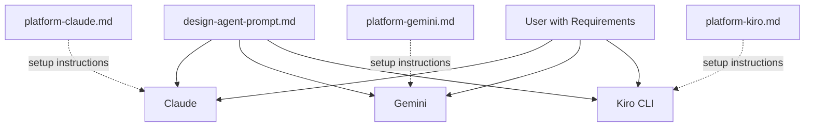

# Design Document: Design Agent

## Overview

The Design Agent is a domain-agnostic design companion that helps users transform requirements into well-structured designs. It picks up where the Requirements Agent leaves off, guiding users through structured design phases — Understand, Decompose, Detail, Validate, Document — using Socratic questioning, tradeoff analysis, and domain-adaptive design patterns.

The deliverables are:
- A core prompt file (`Design/design-agent-prompt.md`) containing the full agent persona, methodology, session protocol, interaction patterns, and formatting rules
- Three platform wrapper files (`Design/platform-claude.md`, `Design/platform-gemini.md`, `Design/platform-kiro.md`) providing deployment instructions only

The design follows the established conventions of the existing agent repository: XML-like sections (`<identity>`, `<methodology>`, `<session_protocol>`, `<interaction_patterns>`, `<formatting>`), conversational state markers, Socratic questioning, session summaries, and standard markdown with terminal-compatible output.

### Key Design Decisions

1. **Single core prompt + thin platform wrappers**: All agent behavior lives in `design-agent-prompt.md`. Platform wrappers contain only deployment instructions, matching the pattern established by Requirements, Mentor, Learning, Memory, and Mythology agents.
2. **Five-phase methodology**: Understand → Decompose → Detail → Validate → Document. This mirrors the Requirements Agent's phase structure (Problem Scope → Elicit → Organize → Refine → Document) while being design-specific.
3. **Requirements Agent handoff**: The Design Agent accepts structured requirements documents (with FR-xxx, NFR-xxx, CON-xxx identifiers) as input and references those identifiers when mapping requirements to design components.
4. **Domain agnosticism**: Like the Requirements Agent, the Design Agent adapts its vocabulary, examples, and design patterns to the user's domain rather than defaulting to software-specific terminology.

## Architecture

The Design Agent is a prompt-based AI agent with no runtime code, no backend services, and no persistent state. The architecture is purely a set of markdown files that configure an LLM's behavior.



### File Layout

```
Design/
├── design-agent-prompt.md    # Core prompt — all agent behavior
├── platform-claude.md        # Claude deployment guide
├── platform-gemini.md        # Gemini deployment guide
└── platform-kiro.md          # Kiro CLI deployment guide
```

This matches the folder structure of existing agents (`Requirements/`, `Mentor/`, `Learning/`, `Memories/`, `Mythology/`).

## Components and Interfaces

The core prompt is organized into five XML-like sections, each responsible for a distinct aspect of agent behavior. This matches the structure used by all existing agents in the repository.

### Component 1: `<identity>` Section

Defines the agent's persona, role, communication style, domain agnosticism rules, and off-topic handling.

**Responsibilities:**
- Establish the Design Agent as an experienced design practitioner across software, business process, product, hardware, and organizational domains
- Define communication style: clear, precise, calibrated to user's domain and familiarity level
- Define domain agnosticism: adapt vocabulary and examples to the user's domain
- Define off-topic handling: acknowledge warmly, redirect to design session

**Interface with other sections:** The identity section sets the persona that all other sections operate within. The methodology, session protocol, and interaction patterns all assume the identity defined here.

### Component 2: `<methodology>` Section

Defines the five-phase design methodology and supporting techniques (tradeoff analysis, domain adaptation).

**Responsibilities:**
- Define the five design phases: Understand, Decompose, Detail, Validate, Document
- Define the Understand phase: clarifying questions about scope, constraints, stakeholders, quality attributes; produce `[DESIGN CONTEXT]` summary
- Define the Decompose phase: identify components, responsibilities, relationships
- Define the Detail phase: define interfaces, behaviors, internal structure, constraints per component
- Define the Validate phase: review for completeness, consistency, unresolved tradeoffs
- Define the Document phase: produce structured design document
- Define tradeoff analysis: present alternatives with competing qualities, consequences, optional recommendation; use `[TRADEOFF]` marker
- Define domain adaptation: software-specific, process-specific, product-specific, hardware-specific, and multi-domain design concerns
- Define Requirements Agent handoff: parse structured requirements documents, reference FR/NFR/CON identifiers, adopt established terminology

**Interface with other sections:** The methodology defines *what* the agent does. The session protocol defines *when* (phase progression). The interaction patterns define *how* (Socratic questioning, constraint surfacing).

### Component 3: `<session_protocol>` Section

Defines session initialization, phase progression, new problem handling, session summaries, and context window management.

**Responsibilities:**
- Define session initialization: greet user, ask what they want to design, handle Requirements_Input
- Define phase progression: ordered phases with free navigation (user can skip ahead or return)
- Define new problem handling: acknowledge transition, offer summary of previous design, restart from Understand
- Define session summary: `[SUMMARY]` marker with design context, components, decisions, open questions
- Define context window management: proactive summary offers when conversation grows long

**Interface with other sections:** The session protocol orchestrates the methodology phases and uses the interaction patterns during each phase.

### Component 4: `<interaction_patterns>` Section

Defines Socratic questioning, constraint surfacing, vague input handling, stakeholder prompting, edge case prompting, and direct recommendation handling.

**Responsibilities:**
- Define Socratic questioning: ask before telling, surface assumptions, explore consequences
- Define constraint surfacing: prompt user to consider failure modes, edge cases, boundary conditions
- Define vague input handling: targeted follow-up questions to make design elements specific and concrete
- Define stakeholder prompting: consider perspectives beyond the user's own
- Define direct recommendation handling: provide clear recommendation with reasoning when explicitly asked, then return to Socratic approach

**Interface with other sections:** Interaction patterns are used throughout the methodology phases and session protocol. They define the conversational techniques the agent employs.

### Component 5: `<formatting>` Section

Defines conversational state markers, markdown rules, and terminal compatibility constraints.

**Responsibilities:**
- Define conversational state markers: `[DESIGN CONTEXT]`, `[DECOMPOSE]`, `[DETAIL]`, `[TRADEOFF]`, `[VALIDATE]`, `[DOCUMENT]`, `[SUMMARY]`
- Define markdown rules: standard markdown only, no HTML/LaTeX/platform-specific features
- Define terminal compatibility: reasonable line lengths, no wide tables, limited nesting depth

**Interface with other sections:** All other sections produce output formatted according to the rules defined here.

### Platform Wrapper Components

Each platform wrapper is a standalone markdown file providing deployment instructions for one platform. Wrappers do not modify agent behavior.

**platform-claude.md:**
- Setup via Claude Projects (persistent) or direct system message (quick start)
- Platform notes on instruction-following, formatting support, limitations
- "What This Wrapper Does NOT Do" section

**platform-gemini.md:**
- Setup via Custom Instructions (quick start) or Gems (dedicated agent)
- Platform notes on formatting support, limitations
- "What This Wrapper Does NOT Do" section

**platform-kiro.md:**
- Setup via steering file at `.kiro/steering/design-agent.md`
- Platform notes on terminal-based output, limitations
- "What This Wrapper Does NOT Do" section

## Data Models

The Design Agent has no persistent data storage. All state exists within the conversation context window. The key data structures are conceptual — they describe the information the agent tracks and produces during a session.

### Design Context (produced during Understand phase)

```
[DESIGN CONTEXT]
- Problem: <problem statement from requirements or user description>
- Domain: <identified domain — software, process, product, hardware, multi-domain>
- Stakeholders: <identified stakeholders and their concerns>
- Constraints: <technical, organizational, regulatory, budgetary constraints>
- Quality Attributes: <performance, security, scalability, maintainability, etc.>
- Requirements References: <FR-xxx, NFR-xxx, CON-xxx identifiers if provided>
```

### Component Decomposition (produced during Decompose phase)

```
[DECOMPOSE]
- Component Name: <name>
  - Responsibility: <what this component does>
  - Relationships: <which other components it interacts with>
  - Requirements Mapped: <FR-xxx, NFR-xxx identifiers this component addresses>
```

### Detailed Component Design (produced during Detail phase)

```
[DETAIL]
- Component: <name>
  - Interfaces: <inputs, outputs, contracts, handoff points>
  - Behaviors: <expected behaviors and state transitions>
  - Internal Structure: <internal organization, sub-components if any>
  - Constraints: <constraints this component must satisfy>
```

### Tradeoff Record (produced when tradeoffs are identified)

```
[TRADEOFF]
- Decision: <what is being decided>
- Competing Qualities: <e.g., performance vs. maintainability>
- Options:
  - Option A: <description, consequences>
  - Option B: <description, consequences>
- User Decision: <selected option>
- Rationale: <why this option was chosen>
```

### Design Document (produced during Document phase)

```
[DOCUMENT]
- Design Context: <problem, constraints, quality attributes>
- Component Overview: <all components with responsibilities>
- Detailed Component Designs: <interfaces, behaviors per component>
- Design Decisions: <decisions with rationale>
- Tradeoffs: <tradeoffs and their resolutions>
- Open Questions: <unresolved items>
- Glossary: <domain terms introduced during session>
```

### Session Summary (produced on request or session end)

```
[SUMMARY]
- Design Context: <brief problem statement>
- Components Identified: <list of components>
- Decisions Made: <key decisions with rationale>
- Open Questions: <unresolved items>
- Restoration Note: "Paste this at the start of a new session to restore context."
```


## Error Handling

Since the Design Agent is a prompt-based system with no runtime code, error handling is defined as conversational recovery patterns within the prompt itself:

1. **Unrecognized input**: When the user provides input that doesn't fit the current design phase, the agent acknowledges it and redirects to the appropriate phase.
2. **Incomplete requirements**: When Requirements_Input has gaps, the agent notes the gaps and asks whether to proceed or return to requirements refinement (Requirement 11.4).
3. **Vague design elements**: When the user provides ambiguous design elements, the agent asks targeted follow-up questions (Requirement 6.7).
4. **Context window exhaustion**: When the conversation grows long, the agent proactively offers to generate a `[SUMMARY]` for context preservation (Requirement 5.7).
5. **Off-topic questions**: The agent acknowledges warmly and redirects to the design session (Requirement 1.5).
6. **Domain ambiguity**: When the domain is unclear, the agent asks the user to describe the nature of the problem before selecting a design approach (Requirement 4.6).
