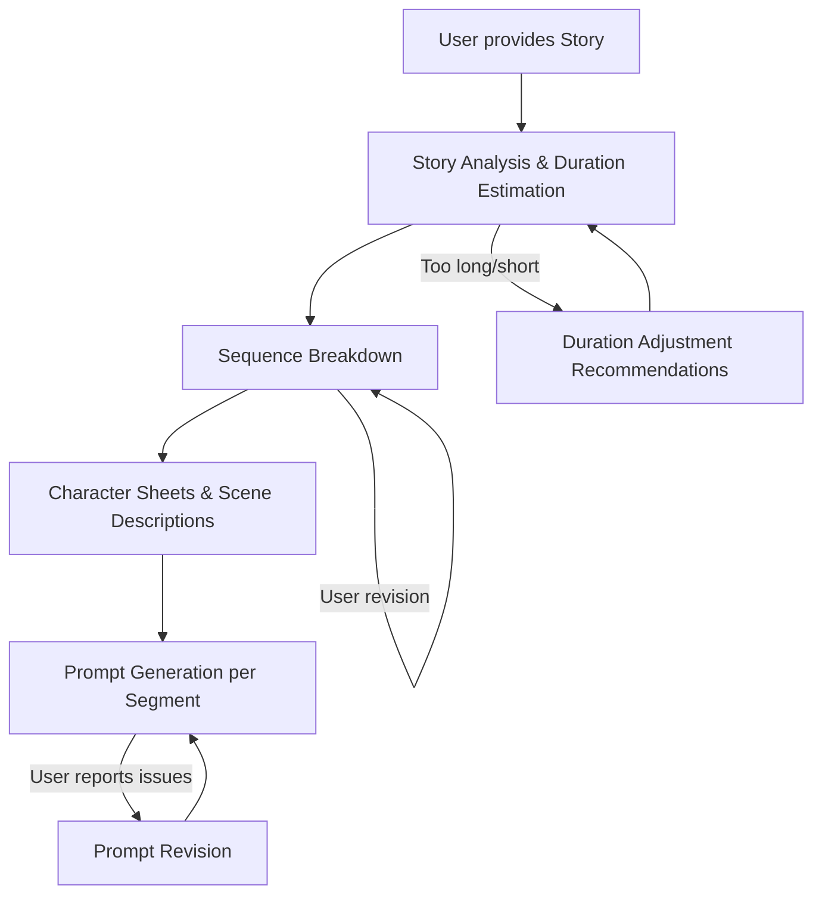

# Design Document: Google Flow Video Agent

## Overview

The Google Flow Video Agent is a prompt-based AI assistant that guides users through transforming stories into 1–2 minute videos using Google Flow's video extension (extend) capability. Since Google Flow generates video in 8-second clips, the Agent acts as a production planner and creative director — breaking stories into filmable sequences, maintaining visual consistency through character sheets and scene descriptions, and writing optimized prompts for video extension.

The deliverables are:
1. A core prompt file (`google-flow-video-agent-prompt.md`) containing the Agent's identity, methodology, and interaction patterns
2. Three platform deployment guides (`platform-kiro.md`, `platform-claude.md`, `platform-gemini.md`)

The Agent is conversational and stateful within a session. It walks users through a structured workflow from story intake to prompt generation output, adapting to user feedback at each stage.

## Architecture

The Agent is a single-prompt AI assistant — no backend services, APIs, or databases. The architecture is entirely defined by the prompt structure and the conversation flow it orchestrates.



The architecture consists of three layers:

1. **Prompt Layer**: The core prompt file defining identity, methodology, domain knowledge, and output formats
2. **Conversation Flow Layer**: The structured phases the Agent guides users through, with feedback loops at each stage
3. **Platform Layer**: Thin deployment wrappers for each target platform (Kiro CLI, Claude, Gemini)

### Design Decisions

- **Single prompt, no tool use**: The Agent relies entirely on conversational guidance rather than API integrations. This maximizes portability across platforms and keeps the Agent accessible to non-technical users.
- **Structured phases with flexible navigation**: The workflow follows a logical production order (story → sequences → characters/scenes → prompts), but users can revisit any phase at any time.
- **Platform-agnostic core**: The core prompt contains zero platform-specific references. All platform concerns live in separate deployment guides.

## Components and Interfaces

### Component 1: Core Prompt (`google-flow-video-agent-prompt.md`)

The core prompt is the single deliverable that defines the Agent's behavior. It contains the following sections:

#### Identity Section
- Agent name, role, and communication style
- Domain expertise declaration (video production, Google Flow capabilities, storytelling)
- Tone: collaborative creative director — knowledgeable but approachable

#### Methodology Section
Defines the structured workflow phases:

1. **Story Intake & Analysis**: Accept story, summarize narrative arc, estimate duration, recommend adjustments if outside 1–2 minute target
2. **Sequence Breakdown**: Decompose story into ordered sequences with timing, narrative purpose, and transition recommendations
3. **Character & Scene Identification**: Extract characters and locations, produce Character Sheets and Scene Descriptions formatted for Google Flow prompts
4. **Prompt Generation**: Write detailed 200–500 word prompts for each segment using video extension, incorporating character/scene consistency references, Hindi narration text written for 2x speed playback by an invisible narrator, and background music suggestions. Prompts focus on visual content sufficient for 8-second clips and maintain a positive visual tone (negative characters convey negativity through expressions, not scary visuals)

#### Google Flow Knowledge Section
- Video extension (extend) capability reference and usage patterns
- Known limitations and workarounds (text rendering, complex multi-character interactions, action consistency)
- Prompt optimization patterns for Google Flow video extension
- Reference image best practices

#### Output Format Templates
- Sequence Breakdown table format
- Character Sheet template
- Scene Description template
- Segment Prompt template

#### Interaction Patterns
- How to handle user feedback and revision requests at each phase
- How to handle ambiguous or incomplete story input
- Session summary and context restoration patterns

### Component 2: Platform Guide — Kiro CLI (`platform-kiro.md`)

- Deployment via steering file at `.kiro/steering/google-flow-video-agent.md`
- Terminal output considerations (markdown rendering, long document handling)
- Limitations: context window management, session persistence

### Component 3: Platform Guide — Claude (`platform-claude.md`)

- Deployment via Claude Projects (persistent) or direct system message (quick start)
- Formatting support notes
- Limitations: context window for long sessions, session persistence

### Component 4: Platform Guide — Gemini (`platform-gemini.md`)

- Deployment via Custom Instructions or Gems
- Formatting support notes
- Limitations: custom instructions length limits, context window, session persistence

### Interfaces Between Components

The core prompt is the only component with behavioral logic. Platform guides are documentation-only and reference the core prompt file by name. There are no runtime interfaces — the "interface" is the user's conversation with the Agent.

## Data Models

Since this is a prompt-based agent with no persistent storage, "data models" here refer to the structured output formats the Agent produces during conversation.

### Sequence Breakdown
```
| # | Sequence Description | Duration (s) | Segments | Narrative Purpose | Transition |
|---|---------------------|--------------|----------|-------------------|------------|
| 1 | [description]       | [8s]         | [1-2]    | [purpose]         | [type]     |
```

### Character Sheet
```
**Character: [Name]**
- Appearance: [physical description]
- Clothing: [outfit details]
- Distinguishing Features: [unique visual markers]
- Props/Accessories: [relevant items]
- Appears in Sequences: [list]
- Appearance Changes: [if any, by sequence]
- Google Flow Prompt Reference: [condensed visual descriptor for prompt inclusion]
```

### Scene Description
```
**Scene: [Location Name]**
- Setting: [environment description]
- Lighting: [conditions]
- Color Palette: [dominant colors]
- Time of Day: [time]
- Weather: [conditions]
- Key Elements: [important visual objects]
- Used in Sequences: [list]
- Environmental Changes: [if any, by sequence]
- Google Flow Prompt Reference: [condensed visual descriptor for prompt inclusion]
```

### Segment Prompt
```
**Segment [#] — Sequence [#]**
- Google Flow Capability: video extension
- Reference Image: [yes/no, description if yes]
- Prompt (200–500 words): "[detailed visual content description focusing on scene, characters, actions, lighting, and style — sufficient for an 8-second video clip. Negative characters convey negativity through expressions and body language, not through frightening visuals.]"
- Narration (Hindi, 2x speed): [Hindi text spoken by an invisible narrator for this segment, written for 2x speed playback]
- Background Music: "[music style/mood suggestion appropriate to the segment's emotional tone]"
```

## Correctness Properties

*A property is a characteristic or behavior that should hold true across all valid executions of a system — essentially, a formal statement about what the system should do. Properties serve as the bridge between human-readable specifications and machine-verifiable correctness guarantees.*

Since this is a prompt-based AI agent (not traditional software with deterministic functions), correctness properties focus on structural validation of the Agent's output formats and the deliverable files themselves. The Agent's conversational quality and subjective judgment (e.g., "is this a good summary?") are not amenable to property-based testing, but the structural completeness and consistency of its outputs are.

### Property 1: Sequence Breakdown Structural Completeness

*For any* Sequence Breakdown output produced by the Agent, every sequence entry SHALL contain a description, an estimated duration in seconds, a narrative purpose, and a transition type to the next sequence (except the last).

**Validates: Requirements 2.1, 2.4**

### Property 2: Sequence Duration Constraints

*For any* sequence in a Sequence Breakdown, the estimated duration SHALL be a multiple of 8 seconds (the Google Flow Segment length), and any sequence whose narrative requires more time than a single 8-second segment allows SHALL be subdivided into multiple segments.

**Validates: Requirements 2.2, 2.3**

### Property 3: Character Sheet Completeness

*For any* character identified in a Sequence Breakdown, a Character Sheet SHALL exist containing physical appearance, clothing, distinguishing features, props/accessories, and a list of sequences in which the character appears. For any character appearing in multiple sequences, appearance changes between sequences SHALL be noted.

**Validates: Requirements 3.1, 3.2, 3.3**

### Property 4: Scene Description Completeness

*For any* distinct location identified in a Sequence Breakdown, a Scene Description SHALL exist containing setting details, lighting conditions, color palette, time of day, weather, and key environmental elements. For any location used in multiple sequences, those sequences SHALL be listed and environmental changes between them SHALL be noted.

**Validates: Requirements 4.1, 4.2, 4.3**

### Property 5: Prompt Structural Completeness

*For any* segment in a Sequence Breakdown, a corresponding Prompt SHALL exist that includes visual content description (scene setting, character actions, lighting, style), narration text, and a background music suggestion. Each Prompt SHALL be between 200 and 500 words in length. Prompts SHALL be numbered sequentially and cross-referenced to their source sequence. Negative characters SHALL be depicted with expressive (not frightening) visual descriptions. Narration text SHALL be in Hindi and authored for 2x speed playback.

**Validates: Requirements 5.1, 5.2, 5.4, 5.5, 5.6, 5.7, 5.9**

### Property 6: Visual Consistency Across Prompts

*For any* two prompts that reference the same character or location, the visual descriptors for that shared element SHALL be identical. Each prompt SHALL incorporate the relevant Character Sheet and Scene Description details to maintain visual consistency.

**Validates: Requirements 5.3**

### Property 7: Core Prompt Platform Agnosticism

*For any* text in the core prompt file (`google-flow-video-agent-prompt.md`), it SHALL contain no references to specific deployment platforms (Kiro, Claude, Gemini, or any other platform names).

**Validates: Requirements 6.5**

## Error Handling

Since this is a prompt-based agent, "error handling" refers to how the Agent responds to problematic user inputs and edge cases during conversation.

### Story Input Issues
- **No clear narrative**: Agent asks clarifying questions about intended story arc, characters, and key moments (Req 1.4)
- **Story too long (>2 min)**: Agent recommends specific cuts or condensation with rationale (Req 1.2)
- **Story too short (<1 min)**: Agent suggests narrative expansions, additional visual beats, or pacing adjustments (Req 1.3)
- **Ambiguous characters/locations**: Agent asks the user to clarify before generating Character Sheets or Scene Descriptions

### Generation Issues
- **Segment doesn't match expectations**: Agent suggests specific prompt revisions addressing the user's identified issues (Req 5.4)

### Revision Handling
- **User requests changes to any component**: Agent revises the specific component and cascades updates to all dependent outputs (Req 2.5)
- **User provides reference images or visual preferences mid-session**: Agent incorporates into relevant Character Sheets or Scene Descriptions (Req 3.5, 4.5)

### Google Flow Limitations
- **Known capability limitations**: Agent proactively notes video extension limitations (text rendering, complex multi-character interactions) and suggests workarounds
- **Segment exceeds clip length**: Agent automatically subdivides into multiple 8-second segments with visual continuity guidance (Req 2.3)

## Testing Strategy

### Dual Testing Approach

Testing for a prompt-based agent differs from traditional software testing. The "code" is the prompt itself, and the "outputs" are conversational responses. Testing focuses on:

1. **Structural validation tests (unit/example tests)**: Verify that output templates and deliverable files meet structural requirements
2. **Property-based tests**: Verify universal properties across generated outputs using randomized inputs

### Unit / Example Tests

- **Deliverable existence**: Verify that all four deliverable files exist (`google-flow-video-agent-prompt.md`, `platform-kiro.md`, `platform-claude.md`, `platform-gemini.md`) — validates Req 6.1–6.4
- **Platform guide structure**: Each platform guide contains setup instructions and a limitations section — validates Req 6.6
- **Prompt narration**: Each Segment Prompt includes Hindi narration text written for 2x speed playback by an invisible narrator — validates Req 5.4
- **Prompt background music**: Each Segment Prompt includes a background music suggestion — validates Req 5.5
- **Prompt word count**: Each Segment Prompt is between 200 and 500 words — validates Req 5.6
- **Prompt visual tone**: Negative characters in Prompts use expressive (not frightening) visual descriptions — validates Req 5.7

### Property-Based Tests

Property-based testing library: **fast-check** (JavaScript/TypeScript) or **Hypothesis** (Python), depending on the test harness chosen for validating prompt outputs.

Each property test should run a minimum of 100 iterations with randomized inputs.

- **Property 1 test**: Generate random sequence breakdowns and validate each entry contains description, duration, narrative purpose, and transition type.
  Tag: `Feature: google-flow-video-agent, Property 1: Sequence Breakdown Structural Completeness`

- **Property 2 test**: Generate random sequences with varying durations and validate all are multiples of 8 seconds within Google Flow's 8-second segment length, with subdivision for longer sequences.
  Tag: `Feature: google-flow-video-agent, Property 2: Sequence Duration Constraints`

- **Property 3 test**: Generate random character sets across random sequences and validate each has a complete Character Sheet with all required fields.
  Tag: `Feature: google-flow-video-agent, Property 3: Character Sheet Completeness`

- **Property 4 test**: Generate random location sets across random sequences and validate each has a complete Scene Description with all required fields.
  Tag: `Feature: google-flow-video-agent, Property 4: Scene Description Completeness`

- **Property 5 test**: Generate random segment sets and validate each has a corresponding prompt with all required fields (visual content, narration, background music), word count between 200–500, sequential numbering, sequence cross-references, and positive visual tone for negative characters.
  Tag: `Feature: google-flow-video-agent, Property 5: Prompt Structural Completeness`

- **Property 6 test**: Generate random prompt sets with shared characters/locations and validate that visual descriptors for shared elements are identical across prompts.
  Tag: `Feature: google-flow-video-agent, Property 6: Visual Consistency Across Prompts`

- **Property 7 test**: Scan the core prompt file text for any platform-specific references and validate none exist.
  Tag: `Feature: google-flow-video-agent, Property 7: Core Prompt Platform Agnosticism`

### Testing Notes

Given that this is a prompt-based agent, many acceptance criteria (especially around conversational quality, subjective judgment, and interactive behavior) are best validated through manual testing and user feedback rather than automated tests. The automated tests above focus on the structural and consistency properties that can be verified programmatically.
