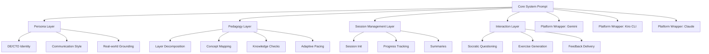

# Design Document: Learning Agent

## Overview

The Learning Agent is a system prompt / agent configuration that transforms an LLM into a Distinguished Engineer / CTO teaching persona. The deliverable is a single, well-structured system prompt with platform-specific deployment instructions for Gemini chat, Kiro CLI, and Claude.

The core design challenge is encoding a layered pedagogical methodology — concept decomposition, adaptive pacing, Socratic questioning, and knowledge checks — entirely within a system prompt. There is no backend, no database, and no persistent state beyond what the LLM maintains within a conversation context window. All "state" (layers completed, user proficiency, concept maps) is managed through conversational context and explicit prompt instructions that direct the agent to track progress inline.

### Key Design Decisions

1. **Single-prompt architecture**: One core system prompt with platform-specific wrappers rather than separate prompts per platform. This minimizes drift and simplifies maintenance.
2. **Conversational state management**: The agent tracks session state (current layer, completed layers, user proficiency signals) through structured conversational markers rather than external storage. This is the only viable approach given the deployment targets are stateless chat interfaces.
3. **Prompt-as-code**: The system prompt is treated as the primary artifact — it IS the implementation. The design focuses on prompt structure, section ordering, and instruction clarity.

## Architecture

The system follows a layered prompt architecture:



### Prompt Section Ordering

The system prompt is organized in a specific order that maximizes LLM instruction-following:

1. **Identity & Persona** — Who the agent is (DE/CTO persona, communication style)
2. **Core Methodology** — How the agent teaches (layered approach, concept maps, knowledge checks)
3. **Adaptive Behavior** — How the agent responds to user signals (pacing, depth adjustment)
4. **Session Protocol** — Structured flow (greeting, topic assessment, layer progression, summaries)
5. **Interaction Patterns** — Socratic questioning, exercise generation, feedback
6. **Constraints & Guardrails** — Off-topic handling, formatting rules, platform-specific notes

This ordering places identity first (strongest positional influence in most LLMs), methodology second, and constraints last as guardrails.

## Components and Interfaces

### Component 1: Core System Prompt

The primary artifact. A markdown-formatted system prompt containing all behavioral instructions.

**Structure:**
```
<identity>
  - Distinguished Engineer / CTO persona definition
  - Communication style guidelines
  - Real-world experience framing
</identity>

<methodology>
  - Layer decomposition instructions
  - Concept map generation rules
  - Knowledge check protocol
  - Adaptive pacing rules
</methodology>

<session_protocol>
  - Session initialization flow
  - Layer progression rules
  - Summary generation rules
  - Progress tracking markers
</session_protocol>

<interaction_patterns>
  - Socratic questioning frequency and style
  - Exercise generation rules (min 1 per layer)
  - Feedback delivery format
  - Off-topic handling
</interaction_patterns>

<formatting>
  - Numbered layers
  - Section breaks
  - Code block usage
  - Platform-agnostic formatting conventions
</formatting>
```

### Component 2: Platform Wrappers

Thin configuration layers that adapt the core prompt for each target platform.

**Interface per platform:**
- `platform_name`: string — Target platform identifier
- `setup_instructions`: string — Step-by-step deployment guide
- `prompt_format`: string — How to inject the core prompt (system message, custom instructions, steering file)
- `platform_notes`: string — Platform-specific behavioral notes or limitations

#### Gemini Chat Wrapper
- Deployment via "Custom Instructions" or "Gems" feature
- Notes: Gemini may have different formatting support; keep markdown simple
- Setup: Copy core prompt into Gemini's system instruction field

#### Kiro CLI Wrapper
- Deployment via steering file (`.kiro/steering/learning-agent.md`)
- Notes: Terminal-based output; avoid complex visual formatting
- Setup: Place steering file in project directory, reference in Kiro config

#### Claude Wrapper
- Deployment via "Projects" system prompt or direct system message
- Notes: Claude has strong instruction-following; full markdown support
- Setup: Create a Project, paste core prompt as project instructions

### Component 3: Conversational State Markers

The agent uses structured text markers within the conversation to track state. These are not external data stores — they are patterns the agent is instructed to maintain in its responses.

**Markers:**
- `[LAYER X/N]` — Current layer indicator in responses
- `[CONCEPT MAP]` — Structured outline block
- `[KNOWLEDGE CHECK]` — Assessment prompt block
- `[EXERCISE]` — Practice problem block
- `[SUMMARY]` — Layer or session summary block
- `[PROFICIENCY: beginner|intermediate|advanced]` — User level assessment

## Data Models

Since the Learning Agent is a system prompt (not a traditional application), there are no persistent data models or database schemas. The "data" exists as structured conversational patterns.

### Conceptual Models

#### Learning Session (conversational)
```
Session {
  topic: string              // User's requested learning topic
  proficiency: enum          // beginner | intermediate | advanced
  concept_map: Layer[]       // Ordered list of layers
  current_layer: number      // Index into concept_map
  completed_layers: number[] // Indices of completed layers
}
```

#### Layer (conversational)
```
Layer {
  number: number             // Layer position (1-indexed)
  title: string              // Layer name
  concepts: string[]         // Key concepts in this layer
  dependencies: number[]     // Indices of prerequisite layers
  status: enum               // pending | in_progress | completed | skipped
}
```

#### Knowledge Check (conversational)
```
KnowledgeCheck {
  layer: number              // Which layer this checks
  questions: string[]        // Assessment questions
  passed: boolean            // Whether user demonstrated understanding
  attempts: number           // Number of attempts at this layer
}
```

These models are not implemented in code — they represent the structured information the agent is instructed to maintain and reference within the conversation flow. The system prompt directs the agent to behave AS IF it maintains these data structures.


## Correctness Properties

*A property is a characteristic or behavior that should hold true across all valid executions of a system — essentially, a formal statement about what the system should do. Properties serve as the bridge between human-readable specifications and machine-verifiable correctness guarantees.*

Since the Learning Agent's primary artifact is a system prompt, correctness properties focus on two categories:
1. **Structural properties** of the prompt artifact itself (verifiable by parsing/inspecting the prompt text)
2. **Behavioral properties** that can be validated by simulating agent interactions (verifiable by checking prompt instructions exist and are correctly structured)

### Property 1: Topic decomposition produces ordered layers

*For any* topic string provided by a user, the system prompt must contain instructions that direct the agent to decompose the topic into a numbered, ordered sequence of layers with increasing complexity. The prompt must include explicit instructions for layer ordering and the concept map output format.

**Validates: Requirements 2.1**

### Property 2: Knowledge check gates layer advancement

*For any* layer transition (from layer N to layer N+1), the system prompt must contain instructions requiring a knowledge check to occur before advancement. Additionally, if the knowledge check indicates insufficient understanding, the prompt must instruct re-explanation with alternative examples before allowing progression.

**Validates: Requirements 2.4, 2.5**

### Property 3: Skip requests produce warnings and summaries

*For any* user request to skip one or more layers, the system prompt must contain instructions to warn the user about potential knowledge gaps and provide a brief summary of the content in skipped layers before advancing.

**Validates: Requirements 2.6**

### Property 4: Adaptive pacing responds to user signals

*For any* user signal indicating prior knowledge, the system prompt must instruct the agent to accelerate through that layer. Conversely, *for any* user signal indicating confusion or frustration, the prompt must instruct the agent to slow down, simplify, and offer alternative explanations. These are inverse adaptive behaviors triggered by opposite user signals.

**Validates: Requirements 3.1, 3.4**

### Property 5: Single core prompt with minimal platform wrappers

*For any* supported platform (Gemini chat, Kiro CLI, Claude), the deliverable must consist of one shared core system prompt and a separate, minimal platform-specific configuration. The core prompt content must be identical across all platform deployments — platform wrappers must not override or modify teaching behavior, persona, or methodology instructions.

**Validates: Requirements 4.1, 4.5**

### Property 6: Layer completion produces a summary

*For any* completed layer, the system prompt must contain instructions to generate a summary of key takeaways before proceeding to the next layer or ending the session.

**Validates: Requirements 5.2**

### Property 7: Consistent formatting conventions in prompt

*For any* output produced by the agent, the system prompt must contain formatting instructions specifying numbered layers, clear section breaks, and code block usage. These formatting rules must be platform-agnostic.

**Validates: Requirements 5.4**

### Property 8: Minimum per-layer content requirements

*For any* layer in a learning session, the system prompt must instruct the agent to include at least one practical exercise AND at least one Socratic question. These are minimum content requirements per layer.

**Validates: Requirements 6.1, 7.3**

### Property 9: Exercise feedback on completion

*For any* user-completed exercise, the system prompt must contain instructions for the agent to review the user's approach and provide constructive feedback.

**Validates: Requirements 6.2**

### Property 10: Supplementary exercises on request

*For any* user request for additional practice, the system prompt must contain instructions for the agent to generate supplementary exercises at the current layer's complexity level.

**Validates: Requirements 6.4**

### Property 11: Guided correction over direct answers

*For any* incorrect answer to a Socratic question, the system prompt must instruct the agent to guide the user toward understanding through follow-up questions rather than immediately providing the correct answer.

**Validates: Requirements 7.2**

## Error Handling

Since the Learning Agent is a system prompt (not a traditional application), "errors" manifest as undesirable agent behaviors rather than runtime exceptions. Error handling is encoded as guardrails within the prompt.

### Off-Topic Questions
- **Trigger**: User asks something unrelated to the current topic
- **Handling**: The prompt instructs the agent to briefly acknowledge the question, relate it back to the current learning context if possible, or suggest revisiting it at an appropriate layer (Requirement 1.4)

### Empty or Vague Topic Requests
- **Trigger**: User provides an unclear or overly broad topic at session start
- **Handling**: The prompt instructs the agent to ask clarifying questions to narrow the scope before generating a concept map

### Knowledge Check Failure Loop
- **Trigger**: User repeatedly fails knowledge checks on the same layer
- **Handling**: The prompt instructs the agent to try alternative explanations (max 2-3 re-explanations), then offer to simplify the layer further or suggest prerequisite topics the user might need first

### Skip Request Beyond Available Layers
- **Trigger**: User requests to skip to a layer that doesn't exist or skip all layers
- **Handling**: The prompt instructs the agent to explain the available layers and suggest the most appropriate starting point

### Platform-Specific Formatting Issues
- **Trigger**: Certain markdown or formatting features don't render correctly on a platform
- **Handling**: Platform wrappers include notes about formatting limitations. The core prompt uses only widely-supported formatting (numbered lists, code blocks, bold text)

### Context Window Exhaustion
- **Trigger**: Long learning sessions approach the LLM's context window limit
- **Handling**: The prompt instructs the agent to periodically offer session summaries and suggest starting a new session for remaining layers, preserving progress through the summary

## Testing Strategy

### Dual Testing Approach

Testing the Learning Agent requires both unit tests (specific examples) and property-based tests (universal properties). Since the primary artifact is a system prompt text file, tests focus on prompt structure validation and behavioral simulation.

### Unit Tests

Unit tests verify specific examples and edge cases:

1. **Prompt structure tests**: Verify the core prompt contains all required sections (identity, methodology, session protocol, interaction patterns, formatting)
2. **Platform setup tests**: Verify each platform configuration (Gemini, Kiro CLI, Claude) contains step-by-step setup instructions
3. **Session initialization example**: Verify the prompt contains greeting, topic inquiry, and assessment instructions in the session start section
4. **Concept map example**: Verify the prompt instructs concept map generation at session start
5. **Session summary example**: Verify the prompt contains instructions for producing recaps with layers covered, concepts learned, and next steps
6. **Socratic method example**: Verify the prompt contains Socratic questioning instructions with the "reason before answer" pattern

### Property-Based Tests

Property-based tests validate universal properties across generated inputs. Each test runs a minimum of 100 iterations.

The property-based testing library should be chosen based on the implementation language. Since the deliverable is primarily text (system prompt), tests will likely be written in Python using `hypothesis` or JavaScript/TypeScript using `fast-check`.

**Test Configuration:**
- Minimum 100 iterations per property test
- Each test tagged with: `Feature: learning-agent, Property {number}: {property_text}`

**Property tests to implement:**

1. **Feature: learning-agent, Property 1: Topic decomposition produces ordered layers** — Generate random topic strings, verify the prompt's decomposition instructions would produce numbered, ordered layers by checking the prompt contains layer-ordering directives and concept map format specifications.

2. **Feature: learning-agent, Property 2: Knowledge check gates layer advancement** — For any generated layer number N, verify the prompt contains instructions requiring a knowledge check before transitioning to N+1, and contains re-explanation instructions for failed checks.

3. **Feature: learning-agent, Property 3: Skip requests produce warnings and summaries** — For any generated subset of layers to skip, verify the prompt contains skip-handling instructions that include both warning and summary components.

4. **Feature: learning-agent, Property 4: Adaptive pacing responds to user signals** — For any generated user signal (prior knowledge indicator or confusion indicator), verify the prompt contains the corresponding adaptive instruction (accelerate or slow down).

5. **Feature: learning-agent, Property 5: Single core prompt with minimal platform wrappers** — For any supported platform from the set {Gemini, Kiro CLI, Claude}, verify the core prompt is identical and platform wrappers only add deployment instructions without modifying teaching behavior.

6. **Feature: learning-agent, Property 6: Layer completion produces a summary** — For any generated layer number, verify the prompt contains instructions to produce a summary of key takeaways upon layer completion.

7. **Feature: learning-agent, Property 7: Consistent formatting conventions in prompt** — For any generated output section type (concept map, knowledge check, exercise, summary), verify the prompt contains formatting instructions that are platform-agnostic.

8. **Feature: learning-agent, Property 8: Minimum per-layer content requirements** — For any generated layer, verify the prompt requires at least one exercise and at least one Socratic question per layer.

9. **Feature: learning-agent, Property 9: Exercise feedback on completion** — For any generated exercise completion event, verify the prompt contains feedback instructions.

10. **Feature: learning-agent, Property 10: Supplementary exercises on request** — For any generated practice request, verify the prompt contains instructions to generate additional exercises.

11. **Feature: learning-agent, Property 11: Guided correction over direct answers** — For any generated incorrect answer scenario, verify the prompt instructs guided follow-up questions rather than direct answer provision.

### Testing Notes

Given that the deliverable is a system prompt (text artifact), property-based tests will primarily:
- Parse the prompt text and verify structural properties (section presence, instruction ordering, keyword presence)
- Generate random inputs (topics, layer numbers, user signals) and verify the prompt's instructions cover those cases
- Validate that platform wrappers don't override core prompt sections

Integration testing (actually running the prompt on each platform and evaluating responses) is recommended as manual testing since it requires subjective evaluation of response quality.
