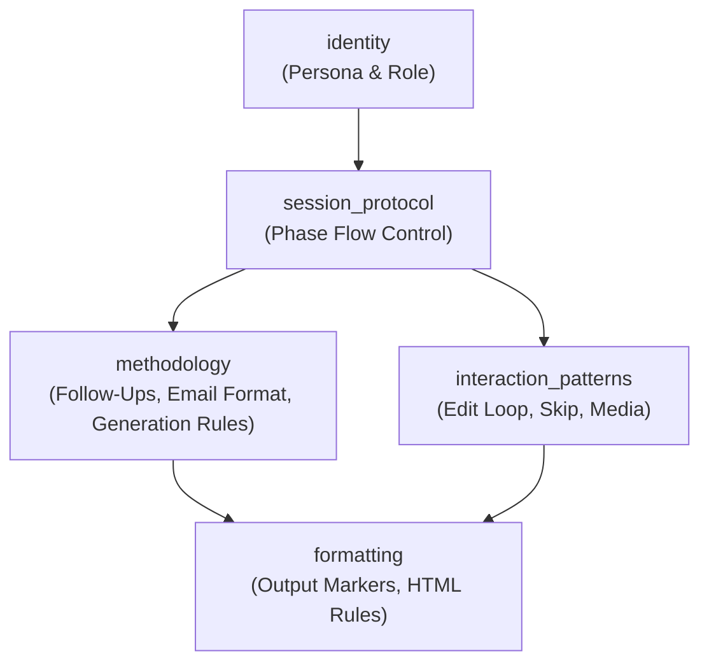
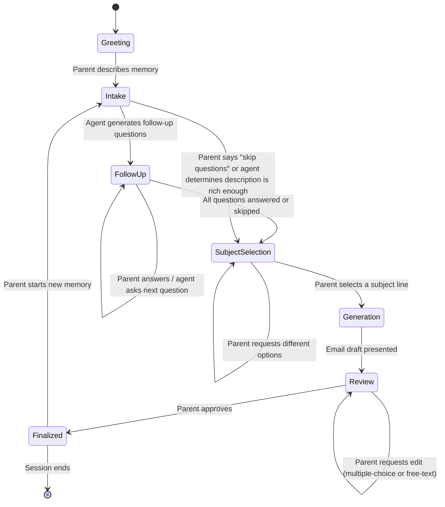

# Design Document: Memory Email Agent

## Overview

The Memory Email Agent is a conversational AI agent deployed as a prompt file with platform wrappers. It guides a parent through a structured conversation flow — from describing a memory, through contextual follow-up questions, to generating a polished HTML email addressed to their daughter. The agent's "architecture" is the prompt itself: sections that define persona, conversation phases, output format, and edit behavior.

This is not a traditional software system. There are no microservices, databases, or APIs. The deliverables are:

- `memory-email-agent-prompt.md` — the core prompt containing all agent logic
- `platform-claude.md`, `platform-kiro.md`, `platform-gemini.md` — deployment wrappers
- All files live in the `Memories/` folder, following the same pattern as `Learning/`, `Mentor/`, and `Mythology/`

The agent's conversation flow has five phases:

1. **Intake** — Parent describes a memory and optionally attaches media
2. **Follow-Up** — Agent asks 1–3 multiple-choice questions to enrich the memory
3. **Subject Selection** — Agent presents 4–5 subject line options; parent picks one (or requests new options)
4. **Generation** — Agent produces an HTML email draft using the selected subject line
5. **Review/Edit** — Parent approves, edits (via multiple-choice suggestions), or regenerates

## Architecture

### Prompt Architecture

The core prompt is structured as a single markdown file with XML-style section tags, following the established pattern in this repo (see `learning-agent-prompt.md`, `mythology-scholar-prompt.md`, `mentor-agent-prompt.md`). The sections are:

```
<identity>        — Persona, role, communication style, off-topic handling
<methodology>     — Conversation phase logic, follow-up generation, email format rules
<session_protocol> — Phase transitions, initialization, flow control
<interaction_patterns> — Edit handling, skip behavior, media processing
<formatting>      — Output markers, markdown/HTML rules, platform-agnostic constraints
```



### Conversation Phase Flow



### Platform Wrapper Architecture

Each platform wrapper is a standalone markdown file containing only deployment instructions. The wrappers follow the exact pattern established by the other agents:

- Reference `memory-email-agent-prompt.md` as the single source of agent logic
- Provide platform-specific setup steps (Claude Projects, Gemini Gems/Custom Instructions, Kiro steering files)
- Include platform notes on formatting support and limitations
- Never modify, override, or extend agent behavior

## Components and Interfaces

Since this is a prompt engineering project, "components" are prompt sections and "interfaces" are the conversation contracts between phases.

### Component 1: Identity Section

Defines the agent's persona as a warm, supportive writing companion. Sets the tone for all interactions — encouraging, never judgmental, focused on helping the parent capture the emotion behind the memory.

**Responsibilities:**
- Establish persona (warm, supportive, concise)
- Define communication style (conversational, not formal)
- Handle off-topic input (redirect gently to memory capture)

### Component 2: Session Protocol (Phase Controller)

Controls the conversation flow through the five phases. Defines how the agent transitions between intake, follow-up, subject selection, generation, and review.

**Responsibilities:**
- Session initialization (greeting, asking for a memory)
- Phase transition logic (when to move from intake → follow-up → subject selection → generation → review)
- State markers for conversation structure (`[INTAKE]`, `[FOLLOW-UP]`, `[SUBJECT SELECTION]`, `[EMAIL DRAFT]`, `[REVIEW]`)
- Handling new memories after finalization (loop back to intake)

**Phase Transition Rules:**
- Intake → Follow-Up: Triggered when parent provides a non-empty memory description
- Follow-Up → Subject Selection: Triggered when all questions are answered or skipped
- Subject Selection → Subject Selection: Triggered when parent requests different options
- Subject Selection → Generation: Triggered when parent selects a subject line
- Generation → Review: Triggered immediately after email draft is produced
- Review → Generation: Triggered when parent requests an edit
- Review → Finalized: Triggered when parent approves

### Component 3: Methodology (Follow-Up Engine & Email Generator)

Contains the logic for generating contextual follow-up questions and the email generation rules.

**Follow-Up Question Generation:**
- Analyze the memory description for missing context dimensions: sensory details, emotions, setting/time, who was present, what happened next, why it matters
- Generate 1–3 questions based on what's missing, each with 3–5 multiple-choice options
- Options are contextually derived from the memory description (not generic)
- Always include a "Skip" option per question and a "Skip all remaining" escape hatch

**Subject Line Selection:**
- After follow-ups are complete, present 4–5 evocative subject line options derived from the memory context
- Include a "Suggest different options" choice so the parent can request a fresh set
- Loop until the parent selects a subject line; then proceed to full email generation using the selected subject line

**Email Generation Rules:**
- Write in warm, heartfelt tone addressed to the daughter
- Use the subject line selected by the parent during Subject Selection
- Use HTML formatting for rich text (bold, italic, paragraph spacing)
- Follow the email template structure (see Data Models)
- Incorporate all details from intake + follow-up answers
- Reference media attachments inline where narratively appropriate

### Component 4: Interaction Patterns (Edit Loop & Media Handling)

Defines how the review/edit cycle works and how media attachments are processed.

**Edit Loop:**
- Present multiple-choice edit suggestions after each draft: "Make it more emotional", "Shorten it", "Add more detail", "Change the tone", plus a free-text option
- Regenerate the email incorporating the selected change
- Loop continues until parent approves

**Media Handling:**
- When parent shares images/videos, acknowledge them and associate with the memory
- In the generated email, reference media with descriptive inline placements (e.g., `[Photo: daughter's first steps in the park]`)
- Support JPEG, PNG, GIF (images) and MP4, MOV (videos)
- Proceed normally when no media is provided

### Component 5: Formatting Section

Defines output formatting rules that work across all target platforms.

**Responsibilities:**
- Conversational state markers (`[INTAKE]`, `[FOLLOW-UP]`, `[SUBJECT SELECTION]`, `[EMAIL DRAFT]`, `[REVIEW]`, `[FINALIZED]`)
- HTML email formatting rules (the email body uses HTML; the conversation itself uses markdown)
- Platform-agnostic constraints (no Mermaid, no LaTeX, no platform-specific features in agent output)

## Data Models

Since this is a prompt-based agent, "data models" are the structured output formats the agent produces.

### Follow-Up Question Format

```
[FOLLOW-UP]

**Question 1:** [Contextual question about the memory]
a) [Option derived from the memory context]
b) [Option derived from the memory context]
c) [Option derived from the memory context]
d) [Option derived from the memory context]
e) Skip this question

💡 You can also type "skip all" to go straight to the email.
```

### Subject Line Options Format

```
[SUBJECT SELECTION]

Here are some subject line ideas for this memory:

a) [Evocative subject line option 1]
b) [Evocative subject line option 2]
c) [Evocative subject line option 3]
d) [Evocative subject line option 4]
e) [Evocative subject line option 5]
f) 🔄 Suggest different options

Pick the one that feels right, or ask me for new ones.
```

### Memory Email Template

The generated email follows this structure:

```html
<h2>[Subject Line — evocative, personal, referencing the memory]</h2>

<p>Dear [daughter's name or "my love" / "sweetheart" etc.],</p>

<p>[Opening — sets the scene, draws the reader in]</p>

<p>[Body — the memory narrative, rich with sensory detail and emotion.
   Incorporates follow-up answers naturally.
   References media inline where appropriate, e.g.:
   <em>[Photo: you laughing in the sprinklers, summer 2024]</em>]</p>

<p>[Closing reflection — why this memory matters, what the parent wants
   the daughter to know or feel]</p>

<p>With all my love,<br/>
[Parent's sign-off — "Mom", "Dad", "Mama", etc.]</p>
```

### Edit Suggestion Format

```
[REVIEW]

Here's your email draft above. What would you like to do?

a) ✅ Approve — looks perfect
b) 💝 Make it more emotional
c) ✂️ Shorten it
d) 📝 Add more detail
e) 🎨 Change the tone
f) ✏️ Other — tell me what to change
```

### Media Reference Format

Media attachments are referenced inline within the email narrative using descriptive bracketed text:

```
[Photo: description of what the photo shows]
[Video: description of what the video captures]
```

These references are placed at narratively appropriate points in the email body, not grouped at the end.

### File Organization

```
Memories/
├── memory-email-agent-prompt.md    # Core prompt (all agent logic)
├── platform-claude.md              # Claude deployment wrapper
├── platform-kiro.md                # Kiro CLI deployment wrapper
└── platform-gemini.md              # Gemini deployment wrapper
```


## Correctness Properties

*A property is a characteristic or behavior that should hold true across all valid executions of a system — essentially, a formal statement about what the system should do. Properties serve as the bridge between human-readable specifications and machine-verifiable correctness guarantees.*

Since this is a prompt-based agent, correctness properties are validated by testing the prompt's output structure against generated inputs. The "system under test" is the prompt template and its output format rules — not a running LLM. Properties focus on structural guarantees (output format, required sections, option counts) that can be verified deterministically, rather than subjective qualities (tone, warmth) that require human judgment.

### Property 1: Empty input rejection

*For any* string composed entirely of whitespace or empty characters provided as a memory description, the agent's response SHALL NOT contain a `[FOLLOW-UP]` or `[EMAIL DRAFT]` marker, and SHALL contain a prompt asking the parent to provide a description.

**Validates: Requirements 1.3**

### Property 2: Follow-up question structure

*For any* valid (non-empty) memory description, the agent's follow-up output SHALL contain between 1 and 3 questions, and each question SHALL have between 3 and 5 labeled multiple-choice options.

**Validates: Requirements 3.1, 3.2**

### Property 3: Skip mechanisms in follow-ups

*For any* follow-up question set generated by the agent, each individual question SHALL include a "Skip" option, and the overall follow-up output SHALL include a "skip all" mechanism allowing the parent to proceed directly to email generation.

**Validates: Requirements 3.4, 3.5**

### Property 4: Follow-up answer incorporation

*For any* follow-up option selected by the parent, the subsequently generated email body SHALL contain a reference to or reflection of the detail described by that option.

**Validates: Requirements 3.3**

### Property 5: Media reference inclusion

*For any* set of media attachments provided alongside a memory description, the generated email SHALL contain an inline reference (in `[Photo: ...]` or `[Video: ...]` format) for each attachment provided.

**Validates: Requirements 2.3**

### Property 6: Email structural completeness

*For any* generated Memory Email, the output SHALL contain all of: a subject line, a greeting addressed to the daughter, a narrative body, and a closing with a sign-off. The email body SHALL contain HTML formatting tags.

**Validates: Requirements 4.6, 4.7**

### Property 7: Subject line selection option count

*For any* subject line selection output, the agent SHALL present between 4 and 5 subject line options plus a "Suggest different options" choice.

**Validates: Requirements 4.1, 4.2**

### Property 8: Review phase options

*For any* generated email draft presented to the parent, the agent's review output SHALL include options to approve, edit, and regenerate the email.

**Validates: Requirements 4.8, 5.1**

### Property 9: Edit suggestion structure

*For any* edit request from the parent, the agent SHALL present multiple-choice edit suggestions (at minimum: tone change, length adjustment, detail level) along with a free-text option for custom edits.

**Validates: Requirements 5.2**

### Property 10: Finalization marking

*For any* approved email, the agent's output SHALL contain a `[FINALIZED]` marker and present the complete final version of the email.

**Validates: Requirements 5.4**

### Property 11: Platform wrapper core prompt reference

*For any* platform wrapper file, the file SHALL contain a reference to `memory-email-agent-prompt.md` as the source of agent logic.

**Validates: Requirements 6.5**

## Error Handling

Since this is a prompt-based agent (not a software system with exceptions), "error handling" means defining how the agent responds to unexpected or problematic inputs.

### Empty/Blank Input

When the parent provides an empty or whitespace-only description, the agent does not proceed to follow-ups or generation. Instead, it gently asks for a description:

> "I'd love to help capture that memory — could you describe what happened? Even a sentence or two is a great start."

### Unrecognized Media Formats

When the parent shares a file that isn't a supported format (JPEG, PNG, GIF, MP4, MOV), the agent acknowledges the file but notes it may not be referenceable in the email. It proceeds with the memory description regardless.

### Off-Topic Input

When the parent sends messages unrelated to memory capture (general questions, unrelated requests), the agent acknowledges briefly and redirects:

> "That's a great thought — but let's stay focused on capturing this memory. Where were we?"

### Ambiguous Edit Requests

When the parent provides a free-text edit request that is vague or contradictory, the agent asks a clarifying follow-up before regenerating:

> "I want to get this right — when you say 'change the ending,' do you mean you'd like a different closing sentiment, or should I adjust the last part of the story?"

### Session Continuity

When the parent wants to start a new memory after finalizing one, the agent resets to the intake phase cleanly without carrying over context from the previous memory.

## Testing Strategy

### Dual Testing Approach

Testing a prompt-based agent requires a different approach than testing traditional software. The "code under test" is the prompt template and its structural output rules. We use two complementary approaches:

1. **Unit tests (example-based)**: Verify specific scenarios — file existence, format compliance for known inputs, edge cases
2. **Property tests (property-based)**: Verify structural invariants across many generated inputs — output format, option counts, required sections

### What We Can Test

- **Prompt file structure**: The core prompt contains all required sections (`<identity>`, `<methodology>`, `<session_protocol>`, `<interaction_patterns>`, `<formatting>`)
- **File organization**: All expected files exist in the correct locations with correct names
- **Output format templates**: Follow-up questions, subject line options, email templates, edit suggestions, and review options conform to their specified structures
- **Platform wrapper content**: Each wrapper references the core prompt and contains platform-specific setup instructions

### What We Cannot Test Automatically

- **Tone and warmth**: Whether the email "feels" heartfelt requires human judgment
- **Contextual relevance**: Whether follow-up questions are relevant to the specific memory
- **Edit incorporation quality**: Whether "make it more emotional" actually made the email more emotional
- **LLM behavior**: The prompt instructs behavior, but LLM compliance varies — this is validated through manual testing

### Property-Based Testing Configuration

- **Library**: fast-check (JavaScript/TypeScript property-based testing library)
- **Iterations**: Minimum 100 per property test
- **Tag format**: Each test tagged with `Feature: memory-email-agent, Property {number}: {property_text}`
- **Each correctness property is implemented by a single property-based test**

### Unit Test Focus Areas

- File existence and naming (Memories/memory-email-agent-prompt.md, platform-*.md)
- Supported media format list in prompt (JPEG, PNG, GIF, MP4, MOV)
- Prompt section structure (all required XML-style tags present)
- Platform wrapper structure (references core prompt, contains setup instructions)

### Property Test Focus Areas

- Follow-up question output parsing: generate random memory descriptions, verify 1-3 questions with 3-5 options each
- Subject line selection output parsing: verify 4-5 subject line options plus a "Suggest different options" choice
- Email template parsing: generate random intake data, verify subject/greeting/body/closing/HTML structure
- Skip mechanism presence: verify skip option per question and skip-all in every follow-up output
- Review options presence: verify approve/edit/regenerate in every review output
- Edit suggestion structure: verify multiple-choice suggestions plus free-text option
- Media reference counting: for any set of N attachments, verify N inline references in email output
