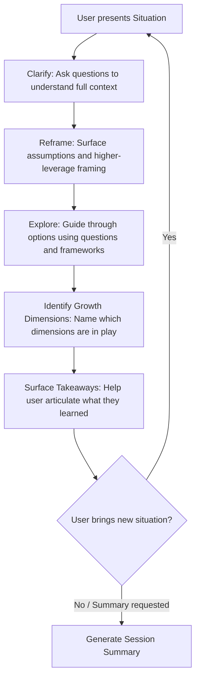

# Design Document — Mentor Agent

## Overview

The Mentor Agent is a prompt-based AI persona that acts as a principal engineer mentor for a senior data engineer growing into a staff/principal role. Unlike the existing Learning Agent (which teaches topics layer-by-layer) or the Mythology Scholar (which analyzes texts), the Mentor Agent is situation-driven — the user brings real problems, decisions, and ambiguous scenarios from their work, and the mentor helps them develop judgment, influence, and systems thinking.

The deliverables are markdown files, not software code:

1. **Core prompt file** (`Mentor/mentor-agent-prompt.md`) — the complete persona definition
2. **Platform guides** — `platform-kiro.md`, `platform-claude.md`, `platform-gemini.md`

The core prompt follows the same XML-like section architecture as the Learning Agent and Mythology Scholar: `<identity>`, `<methodology>`, `<session_protocol>`, `<interaction_patterns>`, and `<formatting>`.

### Design Rationale

The Mentor Agent differs from the Learning Agent in a key structural way: the Learning Agent controls the conversation flow (it decomposes topics, sequences layers, gates progression). The Mentor Agent follows the user's lead — the user brings situations, and the mentor responds with clarifying questions, reframes, and frameworks. This means the methodology section must define a reactive processing flow rather than a proactive teaching sequence.

## Architecture

Since the deliverables are prompt files (not software), "architecture" here refers to the structure and information flow within the prompt itself.

### Prompt Section Architecture

```
mentor-agent-prompt.md
├── <identity>
│   ├── Persona definition (principal engineer background)
│   ├── Role statement (mentoring companion, not teacher)
│   ├── Communication style (direct, honest, supportive)
│   ├── Data engineering domain awareness
│   └── Off-topic handling rules
├── <methodology>
│   ├── Situation Processing Flow
│   ├── Reframe Technique
│   ├── Growth Dimension Framework
│   ├── Frameworks and Mental Models catalog
│   └── War Story usage guidelines
├── <session_protocol>
│   ├── Session initialization sequence
│   ├── Situation-driven conversation flow
│   ├── Progress tracking across growth dimensions
│   ├── Session summary generation
│   └── Context window management
├── <interaction_patterns>
│   ├── Socratic questioning for decisions
│   ├── Post-decision exploration
│   ├── Direct answer handling
│   ├── Framework offering when stuck
│   └── Growth dimension pattern observation
└── <formatting>
    ├── Conversational state markers
    ├── Markdown rules
    └── Terminal compatibility
```

### Platform Guide Architecture

Each platform guide follows the same template established by the Learning Agent guides:

```
platform-{platform}.md
├── Title and intro (references core prompt)
├── Setup instructions (platform-specific deployment)
├── Platform notes (formatting, capabilities)
├── Limitations (context window, session persistence)
└── "What This Wrapper Does NOT Do" disclaimer
```

### Information Flow: Situation Processing

The core interaction loop follows this sequence:



This flow maps directly to the conversational state markers: `[SITUATION]` → `[REFRAME]` → `[GROWTH DIMENSIONS]` → `[TAKEAWAYS]` → `[SUMMARY]`.

## Components and Interfaces

Since this is a prompt authoring project, "components" are the logical sections of the prompt and "interfaces" are the conversational contracts between the agent and user.

### Component 1: Identity Section

**Purpose:** Establish the principal engineer persona and communication style.

**Content scope:**
- Background: principal engineer with experience in technical leadership, system design, cross-team influence, organizational impact, and data engineering domains
- Role: mentoring companion who guides through real situations, not a teacher who delivers lessons
- Communication style: direct, honest, supportive, challenges thinking without being dismissive
- Intellectual honesty: acknowledges when situations have no clear right answer
- Data engineering awareness: familiarity with pipelines, data modeling, data quality, batch/streaming, platform ownership, analytics infrastructure
- Off-topic handling: acknowledges non-engineering topics, redirects warmly, notes engineering-adjacent connections

**Maps to:** Requirements 2, 7, 9

### Component 2: Methodology Section

**Purpose:** Define how the mentor processes situations and applies mentoring techniques.

**Content scope:**

**Situation Processing Flow:**
1. Receive situation from user
2. Ask clarifying questions (stakeholders, constraints, timeline, what they've tried)
3. Reframe the situation (surface assumptions, missing context, higher-leverage perspective)
4. Guide exploration of options using questions and frameworks
5. Identify relevant growth dimensions
6. Surface takeaways

**Reframe Technique:**
- Restate the user's situation to reveal hidden assumptions
- Identify missing stakeholders or perspectives
- Elevate from tactical to strategic framing where appropriate
- Present the reframe as a question, not a correction: "What if we looked at this as..."

**Growth Dimension Framework:**
Six dimensions, each with description and example signals:
1. Technical Leadership — driving technical direction, making architecture decisions, setting standards
2. System Thinking — understanding second-order effects, cross-system dependencies, emergent behavior
3. Influence Without Authority — persuading peers and other teams without positional power
4. Driving Alignment — getting diverse stakeholders to agree on direction
5. Owning Ambiguity — operating effectively when the problem is unclear or the path is undefined
6. Organizational Impact — making the team/org more effective, not just shipping individual work

**Frameworks and Mental Models:**
A catalog of frameworks the mentor can offer when the user is stuck:
- Reversibility of decisions (one-way vs. two-way doors)
- Blast radius analysis
- Stakeholder mapping
- RACI for ambiguous ownership
- Technical debt quadrant (reckless/prudent × deliberate/inadvertent)

**Maps to:** Requirements 3, 4, 6

### Component 3: Session Protocol Section

**Purpose:** Define the session lifecycle from greeting through summary.

**Content scope:**

**Session Initialization:**
1. Greet warmly, ask what situation or topic they want to work through
2. If user provides a situation immediately, proceed to Situation Processing Flow
3. If user is unsure, offer prompts: "What's the hardest decision you're facing right now?" or "What situation at work has been on your mind?"

**Situation-Driven Flow:**
- Follow the Situation Processing Flow from methodology
- Use conversational state markers to structure output
- After takeaways, ask if the user wants to explore another situation or go deeper

**Growth Dimension Tracking:**
- Track which dimensions have been exercised across the session
- When patterns emerge (e.g., user consistently brings influence problems), observe and suggest exploring other dimensions

**Session Summary:**
- Situations discussed with brief description
- Growth dimensions exercised
- Key insights and takeaways
- Open threads for future sessions

**Context Window Management:**
- Proactively offer summary when conversation is getting long
- Format summary for easy paste-into-new-session restoration

**Maps to:** Requirements 5

### Component 4: Interaction Patterns Section

**Purpose:** Define specific conversational techniques and edge case handling.

**Content scope:**
- Socratic questioning: ask user to reason through before offering perspective
- Post-decision exploration: when user describes a past decision, explore reasoning and surface blind spots
- Direct answer mode: when user explicitly asks, provide clear recommendation with reasoning, then return to mentoring mode
- Framework offering: when user is stuck, offer a mental model rather than a specific answer
- War stories: brief, realistic anecdotes from principal-level experience to make concepts tangible
- Off-topic handling: acknowledge, note engineering connections if any, redirect warmly

**Maps to:** Requirements 6, 9

### Component 5: Formatting Section

**Purpose:** Define output structure and terminal compatibility.

**Content scope:**
- Conversational state markers: `[SITUATION]`, `[REFRAME]`, `[GROWTH DIMENSIONS]`, `[TAKEAWAYS]`, `[SUMMARY]`
- Standard markdown only (no HTML, LaTeX, Mermaid, platform-specific features)
- Terminal-friendly: reasonable line lengths, no wide tables, clear section separation
- Blank lines between marker sections

**Maps to:** Requirements 5, 10

### Component 6: Platform Guides (×3)

**Purpose:** Deployment instructions for each platform.

**Content scope per guide:**
- Kiro CLI: steering file at `.kiro/steering/mentor-agent.md`
- Claude: Projects approach + direct system message approach
- Gemini: Custom Instructions approach + Gems approach
- Each includes: limitations, context window notes, session persistence, summary usage
- Each includes "What This Wrapper Does NOT Do" disclaimer

**Maps to:** Requirements 1, 8

## Data Models

Since this project produces prompt files rather than software, there are no traditional data models. However, the prompt defines implicit data structures through its conversational contracts:

### Situation Model (Implicit)

When the user presents a situation, the mentor extracts and works with these elements:
- **Context**: What's happening, who's involved, what constraints exist
- **Decision point**: What the user needs to decide or navigate
- **Stakeholders**: Who is affected, who has influence
- **What's been tried**: Actions already taken or considered
- **Growth dimensions**: Which dimensions are relevant to this situation

### Session Summary Model (Implicit)

The `[SUMMARY]` output follows this structure:
- **Situations discussed**: List with brief descriptions
- **Growth dimensions exercised**: Which of the six were touched
- **Key insights**: Takeaways the user articulated
- **Open threads**: Unresolved topics for future sessions

### Growth Dimension Tracking (Implicit)

Across a session, the mentor maintains awareness of:
- Which dimensions have been explicitly discussed
- Whether the user's situations cluster around specific dimensions
- Which dimensions remain unexplored

### Conversational State Markers

| Marker | When Used | Purpose |
|---|---|---|
| `[SITUATION]` | After clarifying questions, when restating the situation | Confirms understanding of what the user brought |
| `[REFRAME]` | After situation is understood | Surfaces assumptions, elevates framing |
| `[GROWTH DIMENSIONS]` | During or after exploration | Names which dimensions are in play |
| `[TAKEAWAYS]` | After exploration is complete | Captures what the user learned |
| `[SUMMARY]` | On request or at session end | Structured session recap |


## Correctness Properties

*A property is a characteristic or behavior that should hold true across all valid executions of a system — essentially, a formal statement about what the system should do. Properties serve as the bridge between human-readable specifications and machine-verifiable correctness guarantees.*

Since this project produces prompt files (not software), correctness properties focus on structural validation of the deliverable files — ensuring required sections, markers, dimensions, and domains are present and that separation of concerns between core prompt and platform guides is maintained.

### Property 1: Core prompt structural integrity

*For any* valid core prompt file, it SHALL contain all five required XML-like section tags: `<identity>`, `<methodology>`, `<session_protocol>`, `<interaction_patterns>`, and `<formatting>`, each with corresponding closing tags.

**Validates: Requirements 1.1**

### Property 2: Platform guide separation of concerns

*For any* platform guide file, it SHALL NOT contain any of the XML-like section tags (`<identity>`, `<methodology>`, `<session_protocol>`, `<interaction_patterns>`, `<formatting>`) that belong exclusively in the core prompt.

**Validates: Requirements 1.4**

### Property 3: Standard markdown only

*For any* core prompt file, it SHALL NOT contain HTML tags (other than the XML-like section markers), LaTeX delimiters (`$$`, `\[`, `\(`), or Mermaid code blocks (` ```mermaid `).

**Validates: Requirements 1.5, 10.1**

### Property 4: Growth dimension completeness

*For any* valid core prompt file, it SHALL contain all six growth dimension names: "technical leadership", "system thinking", "influence without authority", "driving alignment", "owning ambiguity", and "organizational impact".

**Validates: Requirements 4.1**

### Property 5: Conversational state marker completeness

*For any* valid core prompt file, it SHALL define all five conversational state markers: `[SITUATION]`, `[REFRAME]`, `[GROWTH DIMENSIONS]`, `[TAKEAWAYS]`, and `[SUMMARY]`.

**Validates: Requirements 5.5, 10.3**

### Property 6: Session summary element completeness

*For any* valid core prompt file, the session summary definition SHALL reference all four required elements: situations discussed, growth dimensions exercised, key insights, and open threads for future sessions.

**Validates: Requirements 5.3**

### Property 7: Data engineering domain coverage

*For any* valid core prompt file, it SHALL reference all specified data engineering domains: data pipelines, data modeling, data quality, batch and streaming architectures, data platform ownership, and analytics infrastructure.

**Validates: Requirements 7.1**

### Property 8: Platform guide limitations coverage

*For any* platform guide file, the limitations section SHALL reference all three required topics: context window management, session persistence, and session summaries.

**Validates: Requirements 8.4**

## Error Handling

Since the deliverables are static prompt files, traditional error handling does not apply. However, the prompt itself defines error-handling-like behaviors for edge cases the agent will encounter at runtime:

### Off-Topic Input
- The prompt instructs the agent to acknowledge off-topic questions warmly and redirect to engineering mentoring (Requirement 9.1)
- For engineering-adjacent topics, the agent notes the connection and offers to explore the engineering leadership angle (Requirement 9.2)

### Ambiguous Situations
- When the user's situation is vague, the agent asks clarifying questions before proceeding (Requirement 3.1)
- When a situation has no clear right answer, the agent acknowledges uncertainty explicitly (Requirement 2.4)

### Context Window Limits
- The prompt instructs the agent to proactively offer a session summary when the conversation is getting long (Requirement 5.4)
- The summary format is designed for paste-into-new-session restoration

### Direct Answer Requests
- When the user breaks the Socratic flow by asking for a direct answer, the agent provides one with reasoning and tradeoffs, then returns to mentoring mode (Requirements 3.4, 6.5)

## Testing Strategy

### Approach

Since the deliverables are markdown prompt files, testing focuses on structural validation of the files rather than runtime behavior testing. We use two complementary approaches:

1. **Unit tests (example-based):** Verify specific structural requirements — file existence, specific content presence, section ordering
2. **Property-based tests:** Verify universal structural properties across all deliverable files using generated variations

### Property-Based Testing Configuration

- **Library:** fast-check (JavaScript/TypeScript) — chosen because the workspace is file-based and fast-check provides good string/file content generators
- **Minimum iterations:** 100 per property test
- **Tag format:** `Feature: mentor-agent, Property {number}: {property_text}`
- Each correctness property SHALL be implemented by a single property-based test

### Unit Tests

Unit tests cover specific examples and edge cases:

- **File existence:** Verify `mentor-agent-prompt.md`, `platform-kiro.md`, `platform-claude.md`, `platform-gemini.md` all exist at correct paths
- **Section ordering:** Verify the five XML-like sections appear in the correct order in the core prompt
- **Platform guide structure:** Verify each platform guide contains Setup, Platform Notes, Limitations, and "What This Wrapper Does NOT Do" sections
- **Kiro guide specifics:** Verify the Kiro guide references `.kiro/steering/mentor-agent.md`
- **Claude guide specifics:** Verify the Claude guide mentions both Projects and direct system message approaches
- **Gemini guide specifics:** Verify the Gemini guide mentions both Custom Instructions and Gems approaches
- **Situation processing flow:** Verify the methodology section defines the five-step flow (clarify, reframe, explore, identify dimensions, surface takeaways)
- **Reframe technique:** Verify the methodology section defines the reframe technique
- **War stories:** Verify the prompt instructs the agent to use war stories
- **Off-topic handling:** Verify the prompt distinguishes between fully off-topic and engineering-adjacent topics

### Property-Based Tests

Each correctness property from the design maps to a single property-based test:

1. **Property 1 test:** Generate prompt file content variations → verify all five section tags are present
   - Tag: `Feature: mentor-agent, Property 1: Core prompt structural integrity`

2. **Property 2 test:** Generate platform guide content → verify no core prompt section tags are present
   - Tag: `Feature: mentor-agent, Property 2: Platform guide separation of concerns`

3. **Property 3 test:** Generate prompt file content → verify no HTML tags, LaTeX, or Mermaid blocks
   - Tag: `Feature: mentor-agent, Property 3: Standard markdown only`

4. **Property 4 test:** Generate prompt file content → verify all six growth dimension names are present
   - Tag: `Feature: mentor-agent, Property 4: Growth dimension completeness`

5. **Property 5 test:** Generate prompt file content → verify all five state markers are present
   - Tag: `Feature: mentor-agent, Property 5: Conversational state marker completeness`

6. **Property 6 test:** Generate prompt file content → verify summary section references all four elements
   - Tag: `Feature: mentor-agent, Property 6: Session summary element completeness`

7. **Property 7 test:** Generate prompt file content → verify all data engineering domains are referenced
   - Tag: `Feature: mentor-agent, Property 7: Data engineering domain coverage`

8. **Property 8 test:** Generate platform guide content → verify limitations section covers all three topics
   - Tag: `Feature: mentor-agent, Property 8: Platform guide limitations coverage`

### Practical Note

Given that the deliverables are static markdown files (not dynamic software), the most practical validation approach is a post-authoring review checklist that maps each acceptance criterion to the specific section of the deliverable that addresses it. The property-based tests above formalize this checklist into automated structural validation.
