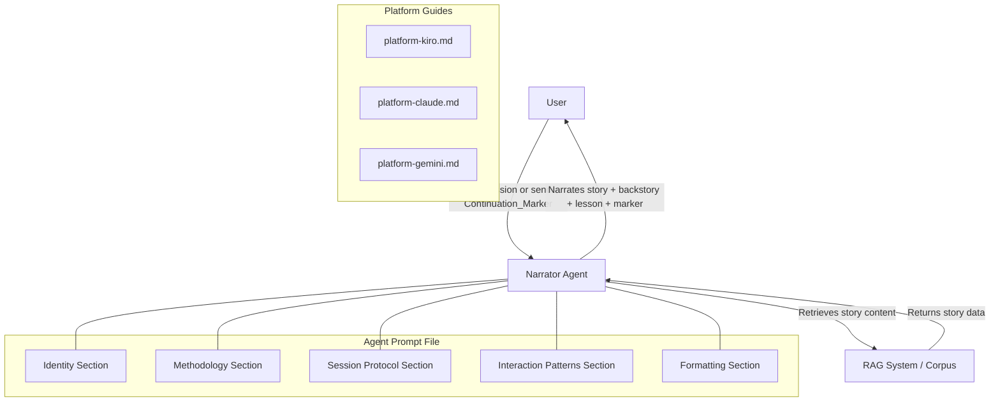
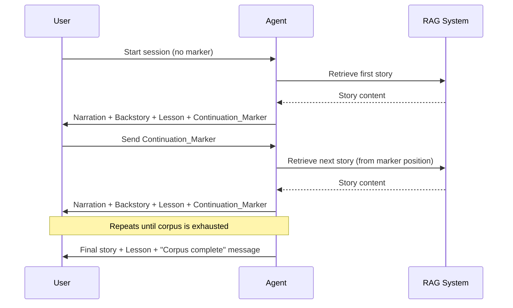

# Design Document: Mythology Story Narrator Agent

## Overview

The Mythology Story Narrator Agent is a storyteller AI agent that narrates mythology stories sequentially from a RAG-backed corpus. It differs from the existing Mythology Scholar Agent (which performs scholarly analysis) by focusing on entertaining, accessible narration with backstory context and real-world lessons.

The deliverables are:
1. A core agent prompt file (`MythologyStories/mythology-story-narrator-prompt.md`) containing identity, methodology, session protocol, interaction patterns, and formatting sections
2. Three platform setup guides (`platform-kiro.md`, `platform-claude.md`, `platform-gemini.md`) that reference the core prompt without duplicating agent logic

The agent follows the structural conventions established by existing agents in the workspace (e.g., the Mythology Scholar Agent in `Mythology/`).

### Design Decisions

- **Single prompt file architecture**: All agent behavior lives in one markdown file. Platform guides are thin deployment wrappers. This mirrors the existing workspace convention and avoids logic duplication.
- **Continuation marker as structured token**: The marker encodes corpus position in a parseable format so the agent can deterministically resume. This is preferred over free-text bookmarking because it's unambiguous and machine-readable.
- **RAG-first narration**: The agent retrieves from the RAG system before narrating, ensuring stories are grounded in source material. If RAG returns nothing, the agent informs the user rather than fabricating content.

## Architecture

The system is a single-file agent prompt that defines the narrator's behavior. There is no backend service, database, or API — the agent operates within the host LLM platform (Kiro CLI, Claude, or Gemini) and relies on the platform's RAG integration for corpus access.



### Narration Flow



## Components and Interfaces

### 1. Core Agent Prompt (`mythology-story-narrator-prompt.md`)

The prompt file contains five top-level XML-style sections, matching the workspace convention:

| Section | Purpose |
|---|---|
| `<identity>` | Defines the narrator persona: a warm, engaging storyteller of mythology. Establishes the agent's role, communication style, and off-topic handling. |
| `<methodology>` | Defines how the agent retrieves from RAG, structures narrations, builds backstory summaries, derives real-world lessons, and manages the continuation marker system. |
| `<session_protocol>` | Defines session initialization (with/without marker), the narration flow per story, end-of-corpus handling, and follow-up handling. |
| `<interaction_patterns>` | Defines how the agent handles edge cases: invalid markers, missing RAG results, user questions mid-narration, requests to skip or go back. |
| `<formatting>` | Defines output structure markers, markdown rules, and terminal compatibility guidelines. |

### 2. Continuation Marker Format

The continuation marker is a structured token the agent emits after each narration. The user sends it back to advance to the next story.

**Format**: `[CONTINUE:story_index:corpus_id]`

| Field | Type | Description |
|---|---|---|
| `story_index` | integer | Zero-based index of the story just narrated |
| `corpus_id` | string | Identifier of the corpus (allows multi-corpus support in the future) |

**Examples**:
- `[CONTINUE:0:greek-myths]` — just narrated story 0 from the "greek-myths" corpus
- `[CONTINUE:14:norse-legends]` — just narrated story 14 from the "norse-legends" corpus

**Parsing rules**:
- The agent checks for the `[CONTINUE:` prefix and `]` suffix
- Extracts `story_index` and `corpus_id` via splitting on `:`
- Computes `next_index = story_index + 1`
- If `next_index` exceeds corpus length, emits the "corpus complete" message
- If the marker is malformed or unrecognizable, the agent informs the user and offers to restart or jump to a specific point

### 3. Narration Output Structure

Each narration response follows this structure:

```
[BACKSTORY]        (if prior context is needed)
<condensed recap of relevant prior events, characters, context>

[NARRATION]
<full story narration in engaging storyteller voice>

[LESSON]
<real-world lesson derived from the story's themes>

[CONTINUE:story_index:corpus_id]
```

- `[BACKSTORY]` is included only when the current story references events or characters from earlier in the corpus. For the first story or standalone stories, it is omitted.
- `[NARRATION]` is always present and contains the complete story.
- `[LESSON]` is always present and contains a specific, practical real-world insight.
- The continuation marker is always the last element (except for the final story in the corpus).

### 4. Platform Guides

Each platform guide follows the same structure as existing guides in the workspace:

| File | Platform | Deployment Mechanism |
|---|---|---|
| `platform-kiro.md` | Kiro CLI | `.kiro/steering/` file |
| `platform-claude.md` | Claude | Projects (persistent) or direct system message (quick start) |
| `platform-gemini.md` | Gemini | Custom Instructions (quick start) or Gems (dedicated) |

Each guide:
- References `mythology-story-narrator-prompt.md` as the single source of agent behavior
- Provides step-by-step deployment instructions
- Documents platform-specific notes and limitations
- Explicitly states it does NOT modify agent logic

## Data Models

### Story (from RAG Corpus)

The agent expects the RAG system to provide story content with the following conceptual structure:

| Field | Type | Description |
|---|---|---|
| `index` | integer | Position of the story in the corpus (zero-based) |
| `title` | string | Name of the story |
| `tradition` | string | Mythological tradition (e.g., Greek, Norse, Hindu) |
| `content` | string | Full narrative text of the story |
| `characters` | string[] | Key characters appearing in the story |
| `themes` | string[] | Central themes (e.g., hubris, transformation, sacrifice) |
| `corpus_id` | string | Identifier of the corpus this story belongs to |

Note: This is a conceptual model. The actual RAG system may return content in a different format. The agent prompt instructs the narrator to extract and work with whatever structure the RAG system provides.

### Continuation Marker

| Field | Type | Description |
|---|---|---|
| `story_index` | integer | Index of the story just narrated |
| `corpus_id` | string | Corpus identifier |

Serialized format: `[CONTINUE:{story_index}:{corpus_id}]`

### Backstory Summary

The backstory summary is not a persisted data model — it is generated on-the-fly by the agent when narrating a story that references prior events. The agent uses the RAG system to retrieve relevant prior stories and synthesizes a condensed recap. The summary includes:

- Key characters previously introduced
- Relevant prior events that the current story builds on
- Any established relationships or conflicts that carry forward


## Correctness Properties

*A property is a characteristic or behavior that should hold true across all valid executions of a system — essentially, a formal statement about what the system should do. Properties serve as the bridge between human-readable specifications and machine-verifiable correctness guarantees.*

### Property 1: Narration contains source content

*For any* story retrieved from the RAG corpus, the narration output should contain key elements (character names, major events) present in the source material.

**Validates: Requirements 1.2**

### Property 2: Continuation marker round-trip

*For any* valid story index N and corpus ID, emitting a continuation marker `[CONTINUE:N:corpus_id]` and then parsing it back should yield `next_story_index = N + 1` and the same `corpus_id`.

**Validates: Requirements 2.2, 5.2, 5.3**

### Property 3: One story per response

*For any* narration response, the output should contain exactly one `[NARRATION]` section.

**Validates: Requirements 2.3**

### Property 4: Sequential corpus progression

*For any* sequence of continuation markers emitted during a full corpus traversal, the story indices should form a strictly increasing sequence incrementing by 1, starting from 0.

**Validates: Requirements 2.4**

### Property 5: Conditional backstory inclusion

*For any* story that references characters or events from earlier stories in the corpus, the narration output should include a `[BACKSTORY]` section. For any story that does not reference prior content, the `[BACKSTORY]` section should be absent.

**Validates: Requirements 3.2**

### Property 6: Lesson always present

*For any* narration response, the output should contain exactly one `[LESSON]` section following the `[NARRATION]` section.

**Validates: Requirements 4.1**

### Property 7: Non-final narrations emit correctly formatted marker

*For any* story that is not the last in the corpus, the narration output should end with a continuation marker matching the format `[CONTINUE:{story_index}:{corpus_id}]` where `story_index` equals the index of the story just narrated. For the last story in the corpus, no continuation marker should be present.

**Validates: Requirements 5.1, 5.2, 5.5**

### Property 8: Invalid marker produces error response

*For any* string that does not match the continuation marker format `[CONTINUE:{integer}:{string}]`, the agent should respond with an error message indicating the marker is not recognized and offer to start from the beginning or a specific point.

**Validates: Requirements 5.4**

### Property 9: Prompt file contains all required sections

*For any* valid agent prompt file, it should contain all five required top-level sections: `<identity>`, `<methodology>`, `<session_protocol>`, `<interaction_patterns>`, and `<formatting>`.

**Validates: Requirements 6.2, 6.3**

### Property 10: Platform guides reference core prompt without duplicating logic

*For any* platform guide file, it should contain a reference to `mythology-story-narrator-prompt.md` and should not contain any of the agent logic section tags (`<identity>`, `<methodology>`, `<session_protocol>`, `<interaction_patterns>`, `<formatting>`).

**Validates: Requirements 7.4**

## Error Handling

### Invalid Continuation Marker

When the user sends a string that doesn't match the `[CONTINUE:{integer}:{string}]` format:
- The agent informs the user the marker is not recognized
- Offers two recovery options: start from the beginning, or specify a story/position to jump to
- Does not crash, hang, or produce a narration from an undefined position

### RAG System Returns No Results

When the RAG system returns empty results for a requested story:
- The agent informs the user the content is not available in the corpus
- Suggests available alternatives (other stories, traditions, or starting from the beginning)
- Does not fabricate story content from general training data

### End of Corpus

When the agent narrates the last story in the corpus:
- The agent completes the narration and lesson as normal
- Instead of emitting a continuation marker, it informs the user the corpus is complete
- May suggest re-reading from the beginning or exploring a different corpus

### Out-of-Range Story Index

When a continuation marker contains a story index that exceeds the corpus length:
- The agent treats this as reaching the end of the corpus
- Informs the user and offers to restart or explore alternatives

### Mid-Narration User Questions

When the user asks a question instead of sending a continuation marker:
- The agent answers the question in the context of the most recently narrated story
- After answering, reminds the user of the continuation marker to proceed

## Testing Strategy

### Dual Testing Approach

Both unit tests and property-based tests are required for comprehensive coverage.

**Unit tests** cover:
- Specific examples: first story narration, last story narration, mid-corpus narration
- Edge cases: empty corpus, single-story corpus, invalid marker formats
- Integration points: RAG retrieval → narration pipeline, marker emit → parse cycle
- File structure: prompt file exists at expected path, platform guides exist at expected paths

**Property-based tests** cover:
- Universal properties across all valid inputs (Properties 1–10 above)
- Randomized marker generation and parsing
- Randomized story sequences for ordering verification
- Randomized invalid inputs for error handling verification

### Property-Based Testing Configuration

- **Library**: fast-check (JavaScript/TypeScript) or Hypothesis (Python), depending on the test harness language used in the project
- **Minimum iterations**: 100 per property test
- **Tagging**: Each property test must include a comment referencing the design property:
  - Format: `Feature: mythology-story-narrator, Property {number}: {property_text}`

### Test Mapping

| Property | Test Type | What It Validates |
|---|---|---|
| Property 1 | Property test | Narration output contains source material elements |
| Property 2 | Property test | Marker serialization/deserialization round-trip |
| Property 3 | Property test | Exactly one narration section per response |
| Property 4 | Property test | Sequential index progression across corpus |
| Property 5 | Property test | Backstory presence correlates with cross-references |
| Property 6 | Property test | Lesson section always present |
| Property 7 | Property test | Marker format and position encoding correctness |
| Property 8 | Property test | Invalid markers produce error responses |
| Property 9 | Property test | Prompt file structural completeness |
| Property 10 | Property test | Platform guides reference core prompt, no logic duplication |
| — | Unit test | First story narration starts at index 0 |
| — | Unit test | Last story omits continuation marker |
| — | Unit test | Empty RAG results produce unavailability message |
| — | Unit test | File existence at expected paths |
