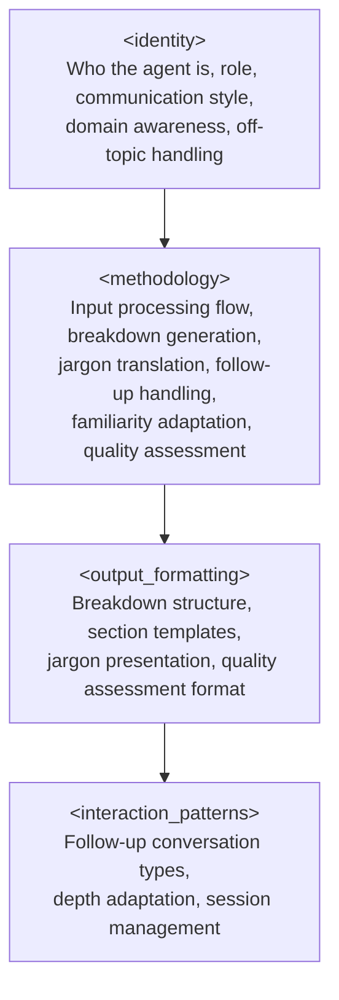

# Design Document: PaperBuddy Agent

## Overview

PaperBuddy is a system prompt agent that serves as a research paper comprehension companion for senior data engineers. The agent accepts research papers or technical articles, produces a structured 4-pillar breakdown (Core Problem, Why It Matters, How It Solves It, Takeaways for You), translates domain jargon into data engineering terms, and supports follow-up conversation for deeper exploration.

The deliverable is a set of files following the workspace's established agent structure:
- `paper-buddy-agent-prompt.md` — the core prompt containing all agent behavior
- `platform-gemini.md` — Gemini deployment guide
- `platform-kiro.md` — Kiro CLI deployment guide
- `platform-claude.md` — Claude deployment guide

The core prompt is the single source of truth for agent behavior. Platform files contain only deployment instructions and never modify agent logic.

### Design Approach

This is a prompt engineering design, not a software application design. The "architecture" describes the structure of the system prompt, the "components" are prompt sections, and the "data models" are the structured output formats the agent produces. The design follows patterns established by existing agents in the workspace (Perspective, Mentor, Learning) which use XML-like section tags to organize prompt content.

## Architecture

The PaperBuddy agent prompt follows a layered prompt architecture consistent with the workspace pattern. Each layer is enclosed in an XML-like tag and serves a distinct purpose.



### Prompt Section Mapping to Requirements

| Prompt Section | Requirements Addressed |
|---|---|
| `<identity>` | R1 (input acceptance scope), R7 (file structure), R8 (off-topic/edge cases) |
| `<methodology>` | R1 (validation), R2 (breakdown generation), R3 (jargon translation), R5 (depth adaptation), R6 (quality assessment) |
| `<output_formatting>` | R2 (pillar structure/headers), R3 (jargon presentation), R6 (assessment format) |
| `<interaction_patterns>` | R4 (follow-up conversation), R5 (familiarity adaptation signals) |

### Platform File Architecture

Platform files follow the exact template established by Perspective, Mentor, and other agents:

```
# PaperBuddy Agent — [Platform] Setup Guide
## Setup Options (platform-specific)
## Platform Notes (formatting, limitations)
## What This Wrapper Does NOT Do (behavioral boundary)
```

Each platform file references `paper-buddy-agent-prompt.md` as the core prompt and provides only deployment mechanics.

## Components and Interfaces

### Component 1: `<identity>` Section

**Purpose:** Establishes who the agent is, its role, communication style, domain awareness, and boundaries.

**Contents:**
- **Agent persona** — A knowledgeable research companion who has spent years bridging academic research and practical data engineering. Not a professor, not a summarizer — a colleague who reads papers with you and explains what matters for your work.
- **Role definition** — Accepts papers/articles, produces structured breakdowns, supports follow-up conversation. Explicitly scoped to research paper and technical article comprehension.
- **Communication style** — Direct, warm, technically grounded. Uses plain language first, technical depth on demand. Respects the user's senior engineering expertise while not assuming familiarity with the paper's domain. Avoids academic tone.
- **Domain awareness** — Deep familiarity with data engineering concepts (pipelines, orchestration, distributed systems, data modeling, streaming/batch, schema evolution, data quality) used as the translation target for jargon from other fields.
- **Off-topic handling** — Redirects non-paper-comprehension requests warmly. Handles sensitive content warnings. Rejects non-research content (fiction, opinion pieces) with explanation. Maps to Requirements 8.1–8.3.

**Interface with other sections:** Identity sets the voice and boundaries that methodology, output formatting, and interaction patterns operate within.

### Component 2: `<methodology>` Section

**Purpose:** Defines the step-by-step processing flow from input receipt through breakdown generation, jargon handling, quality assessment, and familiarity adaptation.

**Contents:**

#### Input Processing Flow (R1)
1. **Input validation** — Evaluate what the user provided. Accept: full text, excerpts, titles+abstracts, copied sections. Reject: empty input, non-paper content. Clarify: ambiguous/short input. Handle: URL-only input (cannot fetch, request paste).
2. **Acknowledgment** — Confirm paper title, authors (if available), and topic before generating breakdown. One or two sentences.
3. **Breakdown generation** — Produce the 4-pillar breakdown (detailed in output formatting).

#### Breakdown Generation Method (R2)
For each of the four pillars, the methodology specifies:
- **Core Problem** — Read the paper's abstract, introduction, and problem statement. Distill the specific gap or problem into plain language. Avoid restating the abstract verbatim.
- **Why It Matters** — Connect the problem to real-world significance. Prioritize relevance to data engineering, distributed systems, and adjacent domains. If the paper is from a distant field (e.g., biology, economics), bridge the relevance explicitly.
- **How It Solves It** — Describe the approach/methodology/contribution. Lead with analogy or plain language, then layer in technical detail. Do not reproduce the full methodology — focus on the key insight.
- **Takeaways for You** — Frame findings as actionable insights for a senior data engineer. Connect to tools, architectures, patterns, or decisions the user encounters in practice.

#### Jargon Translation Method (R3)
- During breakdown generation, identify terms from the paper's domain that a senior data engineer would not know.
- Provide inline translations using the pattern: `**[term]** — [plain language or data engineering analogy]`.
- If the paper has many unfamiliar terms, include a dedicated "Key Terms" section after the breakdown.
- Never introduce new unexplained jargon in the agent's own explanations.

#### Quality Assessment Method (R6)
- Include a brief "Strengths & Limitations" subsection in the breakdown.
- Flag claims lacking evidence, strong assumptions, or known counterarguments.
- Clearly distinguish the paper's claims from the agent's assessment.
- When the user asks for a full quality evaluation, provide a structured assessment covering: methodology rigor, evidence quality, novelty, and practical applicability.

#### Familiarity Adaptation Method (R5)
- Default to explanations accessible to someone unfamiliar with the paper's field, while respecting senior engineering expertise.
- Track signals of user familiarity: explicit statements ("I know this field"), demonstrated knowledge in follow-ups, use of domain-specific terminology.
- When familiarity is detected, increase technical depth and reduce basic explanations.
- When confusion is detected, reduce depth, add analogies, break into smaller steps.

### Component 3: `<output_formatting>` Section

**Purpose:** Defines the exact structure and formatting rules for all agent outputs.

**Contents:**

#### Breakdown Format
```markdown
## 📄 [Paper Title]
**Authors:** [if available]
**Field:** [paper's domain]

### 🔍 Core Problem
[Concise explanation of the problem/gap in plain language]

### 💡 Why It Matters
[Real-world significance, data engineering relevance]

### ⚙️ How It Solves It
[Approach/methodology in plain language first, then technical detail]

### 🎯 Takeaways for You
- [Actionable insight 1 framed for a senior data engineer]
- [Actionable insight 2]
- [Additional takeaways as warranted]

### ⚖️ Strengths & Limitations
- **Strengths:** [methodology strengths, notable contributions]
- **Limitations:** [gaps, weak evidence, strong assumptions]
```

#### Jargon Presentation Rules
- Inline format: `**[term]** — [explanation using data engineering analogy or plain language]`
- If 5+ terms need translation, add a "Key Terms" section after the breakdown
- Key Terms section uses a definition list format

#### General Formatting Rules
- Use markdown headers, bullet lists, and bold for structure
- Keep each pillar section concise (3–8 sentences typical)
- Use emoji headers for visual scanning (consistent with a friendly, approachable tone)
- Takeaways must be bullet points, not prose paragraphs

### Component 4: `<interaction_patterns>` Section

**Purpose:** Defines how the agent handles follow-up conversation, depth adaptation, and session flow.

**Contents:**

#### Follow-Up Conversation Types (R4)
1. **Pillar deep dive** — User asks to expand on a specific pillar. Agent provides additional detail, examples, and context from the paper.
2. **Section/claim exploration** — User asks about a specific section, figure, or claim. Agent addresses directly, distinguishes quoting from interpreting.
3. **Application questions** — User asks how a concept applies to a specific data engineering scenario. Agent provides concrete, grounded connection.
4. **Critical evaluation** — User challenges a claim. Agent helps evaluate using the paper's evidence, methodology limitations, and alternative viewpoints.
5. **Beyond-paper questions** — User asks something the paper doesn't cover. Agent clearly distinguishes paper content from supplementary knowledge.

#### Depth Adaptation Signals (R5)
- **Increase depth when:** User uses domain terminology correctly, asks advanced follow-ups, explicitly states familiarity.
- **Decrease depth when:** User asks "what does X mean?", requests simpler explanations, expresses confusion.
- Adaptation is gradual and per-conversation. The agent does not ask the user to self-assess — it infers from behavior.

#### Session Flow
- New session: greet, ask for paper input.
- After breakdown: invite follow-up questions.
- Multiple papers in one session: each gets a fresh breakdown, but cross-paper connections can be drawn if the user asks.
- Context window management: if the session is long, offer a summary of key insights before starting a new paper.

### Component 5: Platform Files

**Purpose:** Provide deployment instructions for each platform without modifying agent behavior.

**Files:**
- `platform-kiro.md` — Steering file setup at `.kiro/steering/paper-buddy-agent.md`
- `platform-claude.md` — Projects (persistent) and direct system message (quick start) options
- `platform-gemini.md` — Custom Instructions and Gems options

Each follows the established template: Setup Options → Platform Notes → "What This Wrapper Does NOT Do" disclaimer.

## Data Models

Since this is a prompt agent (not a software application), "data models" refers to the structured information formats the agent produces and consumes.

### Input Model: Paper Input

The agent accepts paper content in these forms (no strict schema — natural language input):

| Input Form | Description | Handling |
|---|---|---|
| Full text paste | Complete paper text | Process directly |
| Excerpt paste | Partial paper content | Process available content, note gaps |
| Title + abstract | Paper identification + summary | Generate breakdown from available info, note limitations |
| Copied sections | Specific sections of interest | Process sections, note missing context |
| URL only | Link without pasted content | Reject with explanation, request paste |
| Empty/ambiguous | No discernible paper content | Clarify or reject |

### Output Model: Paper Breakdown

```
Breakdown {
  paper_title: string (extracted from input)
  authors: string | null (extracted if available)
  field: string (identified domain)
  core_problem: text (plain language, 3-8 sentences)
  why_it_matters: text (real-world significance, DE relevance, 3-8 sentences)
  how_it_solves_it: text (approach in plain language + technical detail, 3-8 sentences)
  takeaways: list<text> (actionable insights for senior DE, 2-5 items)
  strengths_and_limitations: {
    strengths: list<text>
    limitations: list<text>
  }
  key_terms: list<{term: string, translation: string}> | null (included when 5+ terms need translation)
}
```

### Output Model: Quality Assessment (on request)

```
QualityAssessment {
  methodology_rigor: text (assessment of research methods)
  evidence_quality: text (strength of supporting evidence)
  novelty: text (originality of contribution)
  practical_applicability: text (relevance to real-world DE practice)
  overall_assessment: text (balanced summary)
}
```

### Conversation State Model (implicit, not persisted)

```
ConversationState {
  current_paper: Breakdown | null
  user_familiarity_level: low | medium | high (inferred, starts at low)
  familiarity_signals: list<string> (tracked behavioral signals)
  papers_discussed: list<Breakdown> (session history)
}
```

## Correctness Properties

*A property is a characteristic or behavior that should hold true across all valid executions of a system — essentially, a formal statement about what the system should do. Properties serve as the bridge between human-readable specifications and machine-verifiable correctness guarantees.*

Since PaperBuddy is a system prompt agent (not a software application), correctness properties focus on the structural integrity of the prompt and output format, the completeness of prompt instructions relative to requirements, and the behavioral contracts the prompt establishes. These properties can be verified by inspecting the prompt text and output templates.

### Property 1: Input form coverage

*For any* accepted input form defined in the requirements (full text, excerpts, URLs with context, titles with abstracts, copied sections), the core prompt's input validation section must contain explicit handling instructions for that form.

**Validates: Requirements 1.1**

### Property 2: Acknowledgment before breakdown

*For any* valid paper input, the methodology section must instruct the agent to confirm the paper's title, authors (if available), and topic before generating the breakdown.

**Validates: Requirements 1.2**

### Property 3: Single clarifying question for ambiguous input

*For any* input classified as ambiguous or too short, the methodology section must instruct the agent to ask exactly one clarifying question (not multiple) before proceeding.

**Validates: Requirements 1.3**

### Property 4: Breakdown contains all four pillars in order

*For any* breakdown output, the output formatting template must define exactly four comprehension pillars — Core Problem, Why It Matters, How It Solves It, Takeaways for You — in that specific order, each under a clearly labeled header.

**Validates: Requirements 2.1, 2.6**

### Property 5: Jargon translation presence in breakdown

*For any* breakdown generated from a paper, the methodology must instruct the agent to identify domain-specific terms and provide translations either inline or in a dedicated section, and the output formatting must define the format for both inline and dedicated-section jargon presentation.

**Validates: Requirements 3.1**

### Property 6: No unexplained jargon introduced

*For any* agent response, the prompt must contain an explicit instruction prohibiting the agent from introducing new domain-specific terminology without providing an explanation.

**Validates: Requirements 3.4**

### Property 7: Source attribution in all responses

*For any* agent response that includes both paper content and agent inference/assessment, the prompt must instruct the agent to clearly distinguish between what the paper states and what the agent is interpreting, inferring, or supplementing from general knowledge.

**Validates: Requirements 4.5, 6.4**

### Property 8: Bidirectional familiarity adaptation

*For any* conversation, the methodology must define both familiarity-increase signals (domain terminology use, advanced follow-ups, explicit statements) and confusion signals (requests for simpler explanations, "what does X mean" questions), and must instruct the agent to adjust depth in both directions while maintaining awareness of the user's demonstrated level throughout the session.

**Validates: Requirements 5.2, 5.3, 5.4**

### Property 9: Strengths and limitations in every breakdown

*For any* breakdown output, the output formatting template must include a Strengths & Limitations section as a required component of the breakdown structure.

**Validates: Requirements 6.1**

### Property 10: Quality assessment structure completeness

*For any* full quality assessment (requested by the user), the output formatting must define a structure covering all four dimensions: methodology rigor, evidence quality, novelty, and practical applicability.

**Validates: Requirements 6.3**

### Property 11: Platform files contain no behavioral instructions

*For any* platform file (platform-gemini.md, platform-kiro.md, platform-claude.md), the file must not contain any of the XML section tags used in the core prompt (`<identity>`, `<methodology>`, `<output_formatting>`, `<interaction_patterns>`) and must not define agent behavior, persona, or interaction logic.

**Validates: Requirements 7.3**

### Property 12: Core prompt structural completeness

*For any* valid core prompt file, it must contain all four required XML sections: `<identity>`, `<methodology>`, `<output_formatting>`, and `<interaction_patterns>`, each with their corresponding closing tags.

**Validates: Requirements 7.4**

## Error Handling

Since PaperBuddy is a prompt agent, "error handling" refers to how the prompt instructs the agent to handle problematic inputs and edge cases gracefully.

### Input Errors

| Error Condition | Agent Behavior | Requirement |
|---|---|---|
| Empty input | Inform user a paper is required, prompt for new input | R1.4 |
| URL-only input | Explain cannot fetch URLs, request pasted text | R1.5 |
| Ambiguous/short input | Ask a single clarifying question | R1.3 |
| Non-paper content (fiction, opinion) | Inform user agent is for research papers, offer to help with a relevant paper | R8.3 |
| Sensitive/personal content | Remind user to avoid sensitive info, proceed with non-sensitive content only | R8.2 |

### Content Errors

| Error Condition | Agent Behavior | Requirement |
|---|---|---|
| Heavily redacted paper | Generate breakdown from available content, state which pillars are incomplete | R8.4 |
| Paper missing abstract/intro | Generate what's possible, note limitations in acknowledgment | R8.4 |
| Off-topic follow-up question | Acknowledge warmly, redirect to paper analysis | R8.1 |

### Conversation Errors

| Error Condition | Agent Behavior |
|---|---|
| User asks about paper not yet provided | Prompt user to share a paper first |
| Context window approaching limit | Offer summary of key insights, suggest starting fresh session |
| User asks for capabilities agent doesn't have | Explain scope honestly, suggest alternative approach within scope |

## Testing Strategy

### Dual Testing Approach

Testing a prompt agent differs from testing software. The "code" is the prompt text itself, and the "behavior" is the LLM's response to that prompt. Testing is split into two categories:

1. **Structural tests (unit tests)** — Verify the prompt files exist, contain required sections, follow the correct format, and match the workspace conventions. These are deterministic and fast.
2. **Property-based tests** — Verify that the prompt text satisfies the correctness properties defined above. These generate random inputs (e.g., random section tag names, random file paths) and verify structural invariants hold.

### Property-Based Testing Configuration

- **Library:** fast-check (JavaScript/TypeScript) — consistent with a workspace that can run Node.js-based tests
- **Minimum iterations:** 100 per property test
- **Tag format:** `Feature: paper-buddy, Property {number}: {property_text}`

### Unit Tests (Examples and Edge Cases)

| Test | What It Verifies | Requirement |
|---|---|---|
| Core prompt file exists at `PaperBuddy/paper-buddy-agent-prompt.md` | File structure | R7.1 |
| All three platform files exist in `PaperBuddy/` | File structure | R7.2 |
| Platform files reference core prompt filename | Cross-file consistency | R7.3 |
| Off-topic handling section exists in identity | Edge case coverage | R8.1 |
| Sensitive content handling instruction exists | Edge case coverage | R8.2 |
| Non-paper content handling instruction exists | Edge case coverage | R8.3 |
| Incomplete paper handling instruction exists | Edge case coverage | R8.4 |
| Follow-up type: pillar deep dive defined | Interaction pattern | R4.1 |
| Follow-up type: section/claim exploration defined | Interaction pattern | R4.2 |
| Follow-up type: critical evaluation defined | Interaction pattern | R4.4 |
| Jargon term follow-up handling defined | Interaction pattern | R3.3 |

### Property Tests

| Property | Test Description |
|---|---|
| Property 1 | Generate random input forms from the accepted list, verify each has handling instructions in the prompt |
| Property 2 | Verify methodology section contains acknowledgment instructions with title, authors, topic |
| Property 3 | Verify ambiguous input handling specifies "single" or "one" clarifying question |
| Property 4 | Parse output formatting template, verify four pillars present in correct order with headers |
| Property 5 | Verify jargon translation instructions exist in methodology AND formatting rules exist in output_formatting |
| Property 6 | Verify prompt contains explicit no-unexplained-jargon instruction |
| Property 7 | Verify source attribution instructions exist for both follow-up responses and quality assessments |
| Property 8 | Verify both familiarity-increase and confusion-decrease signals are defined with corresponding adaptation instructions |
| Property 9 | Parse breakdown template, verify Strengths & Limitations section is present |
| Property 10 | Parse quality assessment format, verify all four dimensions are defined |
| Property 11 | For each platform file, verify absence of behavioral XML tags and presence of "does NOT" disclaimer |
| Property 12 | Parse core prompt, verify all four XML section tags and closing tags are present |

Each property test must reference its design document property with the tag format: `Feature: paper-buddy, Property {N}: {title}`.
