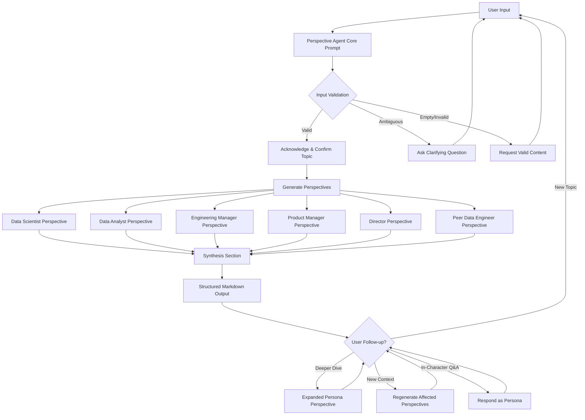

# Design Document: Perspective Agent

## Overview

The Perspective Agent is a prompt-based conversational AI agent that analyzes user-provided input (topics, articles, proposals, architecture decisions, etc.) through the lens of six default cross-functional personas commonly found in a senior data engineer's professional ecosystem. The agent produces structured, multi-perspective output that helps the user anticipate stakeholder reactions, questions, and objections before presenting work to real colleagues.

The agent is not a software application with runtime code — it is a set of markdown prompt files deployed to AI platforms (Claude, Gemini, Kiro). The "architecture" is therefore the prompt structure, the persona definitions, the output formatting rules, and the platform deployment wrappers.

This design follows the established workspace pattern observed in agents like Mentor, Proposal, Design, and others: a single core prompt file (`perspective-agent-prompt.md`) containing all agent behavior, plus platform-specific deployment guides (`platform-claude.md`, `platform-gemini.md`, `platform-kiro.md`) that contain only setup instructions.

## Architecture

The Perspective Agent follows a stateless, prompt-driven architecture. There is no backend, database, or API. The entire agent is defined by its prompt files, and all "processing" happens within the LLM's inference at conversation time.



### File Structure

```
Perspective/
├── perspective-agent-prompt.md   # Core prompt: identity, personas, methodology, output rules
├── platform-claude.md            # Claude deployment guide
├── platform-gemini.md            # Gemini deployment guide
└── platform-kiro.md              # Kiro CLI deployment guide
```

### Design Decisions

1. **Single core prompt file**: All agent behavior lives in `perspective-agent-prompt.md`. This matches the workspace convention and ensures platform files never drift from the core behavior. Platform files are deployment wrappers only.

2. **Fixed default persona set**: The six personas (Data Scientist, Data Analyst, Engineering Manager, Product Manager, Director, Peer Data Engineer) are hardcoded in the prompt rather than dynamically configurable. This keeps the prompt simpler and the output predictable. The personas are tailored to a senior data engineer's real stakeholder ecosystem.

3. **Structured output with subsections**: Each perspective uses a consistent four-subsection format (Key Concerns, Likely Questions, Potential Objections/Risks, Areas of Support/Enthusiasm) to make output scannable and comparable across personas.

4. **Synthesis section**: A cross-persona synthesis at the end surfaces common themes, disagreements, and action items — the highest-value output for someone preparing to present to real stakeholders.

5. **Iterative refinement via conversation**: Rather than a one-shot output, the agent supports follow-up interactions: deeper dives on specific personas, incorporating new context, and in-character Q&A. This is handled through conversation flow instructions in the prompt, not through any external state management.

## Components and Interfaces

Since this is a prompt-based agent (no runtime code), "components" refers to the logical sections of the core prompt and the platform deployment files.

### Core Prompt Components (`perspective-agent-prompt.md`)

| Component | Purpose |
|---|---|
| `<identity>` | Agent identity, role description, communication style, domain awareness, off-topic handling |
| Persona Definitions | Six persona blocks, each defining the persona's professional priorities, concerns, vocabulary, and mental models |
| `<methodology>` | Input processing flow: validation → acknowledgment → perspective generation → synthesis |
| Output Formatting Rules | Markdown structure for perspectives (headers, subsections, synthesis), consistent across all personas |
| `<interaction_patterns>` | Iterative refinement rules: deeper dives, context updates, in-character responses |
| `<session_protocol>` | Session initialization, greeting, and conversation flow management |

### Platform File Components

Each platform file (`platform-claude.md`, `platform-gemini.md`, `platform-kiro.md`) contains:

| Component | Purpose |
|---|---|
| Setup Instructions | Step-by-step deployment for the specific platform (Projects/Gems/Steering files) |
| Platform Notes | Formatting support, limitations, context window considerations |
| Behavioral Boundary | Explicit statement that the platform file does not modify agent behavior |

### Interfaces

The agent has one interface: the conversational interface between the user and the LLM. The "API" is natural language.

- **Input**: Free-text topics, pasted excerpts, proposal summaries, architecture decision descriptions, presentation outlines
- **Output**: Structured markdown with persona-labeled sections, subsections, and a synthesis section
- **Follow-up Input**: Requests for deeper dives, additional context, in-character questions
- **Follow-up Output**: Expanded perspectives, regenerated perspectives, in-character responses

## Data Models

There are no persistent data models — the agent is stateless. However, the prompt defines implicit data structures that govern the output format:

### Perspective Structure (per persona)

```
## [Persona Name] Perspective

### Key Concerns
- [Bullet list of concerns from this persona's viewpoint]

### Likely Questions
- [Questions this persona would ask]

### Potential Objections or Risks
- [Objections or risks this persona would raise]

### Areas of Support or Enthusiasm
- [Aspects this persona would be excited about or supportive of]
```

### Synthesis Structure

```
## Synthesis

### Common Themes
- [Themes that appear across multiple personas]

### Key Disagreements
- [Areas where personas would disagree or have conflicting priorities]

### Suggested Areas to Address
- [Action items for the user before presenting to real stakeholders]
```

### Persona Definition Structure (in core prompt)

Each persona is defined with:
- **Name**: The role title (e.g., "Data Scientist")
- **Focus Areas**: The professional priorities and concerns specific to this role
- **Mental Model**: How this persona thinks about problems and evaluates proposals
- **Vocabulary**: Domain-specific language this persona would use


## Correctness Properties

*A property is a characteristic or behavior that should hold true across all valid executions of a system — essentially, a formal statement about what the system should do. Properties serve as the bridge between human-readable specifications and machine-verifiable correctness guarantees.*

Since the Perspective Agent is a prompt-based agent (not runtime software), the testable properties focus on the structural correctness of the prompt files themselves — verifying that the files contain the required content, follow the workspace conventions, and maintain the separation between core behavior and platform deployment.

Many acceptance criteria (1.1–1.4, 2.3, 5.1–5.3, 7.1–7.3) describe LLM conversational behaviors that are not computationally testable as properties. These are enforced by the prompt instructions and validated through manual testing.

### Property 1: Platform files contain no behavioral definitions

*For any* platform file in the Perspective/ folder (platform-claude.md, platform-gemini.md, platform-kiro.md), the file SHALL NOT contain agent behavioral sections such as `<identity>`, `<methodology>`, `<interaction_patterns>`, `<session_protocol>`, or persona definition blocks. Platform files must contain only deployment instructions.

**Validates: Requirements 6.3**

### Property 2: All personas have complete focus area definitions

*For any* persona in the default persona set (Data Scientist, Data Analyst, Engineering Manager, Product Manager, Director, Peer Data Engineer), the core prompt SHALL contain a persona definition that includes all required focus areas specified for that persona in the requirements.

**Validates: Requirements 3.1, 3.2, 3.3, 3.4, 3.5, 3.6**

## Error Handling

Since the Perspective Agent is a prompt-based system with no runtime code, "error handling" refers to how the prompt instructs the LLM to handle problematic inputs and edge cases.

### Input Validation Errors

| Condition | Agent Behavior |
|---|---|
| Empty or no-content input | Inform user that valid content is required; prompt for new input (Req 1.4) |
| Ambiguous or overly broad input | Ask a clarifying question to narrow scope before proceeding (Req 1.2) |
| Sensitive/personal/confidential content | Remind user to avoid sharing sensitive information; proceed only with non-sensitive content (Req 7.2) |

### Scope Boundary Errors

| Condition | Agent Behavior |
|---|---|
| Off-topic question (outside perspective analysis) | Acknowledge the question; redirect back to perspective analysis (Req 7.1) |
| Non-professional/non-technical topic | Inform user the agent is designed for professional/technical analysis; offer to help with a relevant topic (Req 7.3) |

### Conversation Flow Errors

| Condition | Agent Behavior |
|---|---|
| User requests deeper dive on non-existent persona | Clarify available personas and offer to expand on one from the default set |
| Context window exhaustion (long sessions) | Offer to summarize the session so the user can start a new conversation with context restored |

## Testing Strategy

### Dual Testing Approach

The Perspective Agent requires both automated and manual testing, but the balance skews heavily toward manual testing because the agent is a prompt-based system whose outputs are natural language.

### Automated Tests (Unit/Example Tests)

Automated tests validate the structural correctness of the prompt files:

1. **File existence**: Verify all four required files exist in `Perspective/` (perspective-agent-prompt.md, platform-claude.md, platform-gemini.md, platform-kiro.md)
2. **Core prompt structure**: Verify the core prompt contains required sections: `<identity>`, `<methodology>`, persona definitions for all six personas, output formatting rules, and interaction patterns
3. **Output template completeness**: Verify the core prompt's output format includes persona-named headers, four required subsections (Key Concerns, Likely Questions, Potential Objections/Risks, Areas of Support/Enthusiasm), and a synthesis section with three subsections (Common Themes, Key Disagreements, Suggested Areas to Address)
4. **Markdown formatting instruction**: Verify the core prompt instructs the use of standard markdown formatting
5. **Workspace convention compliance**: Verify file naming follows the `{agent-name}-prompt.md` and `platform-{platform}.md` patterns

### Property-Based Tests

Property-based tests validate universal properties across the file set:

- **Library**: Since the deliverables are markdown files (not code), property-based tests will be implemented using a scripting language available in the workspace. Given the workspace has no package.json or runtime, tests can be written as simple shell scripts or a lightweight test runner.
- **Minimum iterations**: 100 per property test (though for static file checks, the iteration count applies to parameterized inputs like the list of personas or platform files)
- **Tag format**: Each test must include a comment referencing the design property:
  - `Feature: perspective-agent, Property 1: Platform files contain no behavioral definitions`
  - `Feature: perspective-agent, Property 2: All personas have complete focus area definitions`

**Property 1 test**: For each platform file, parse the content and assert it does not contain behavioral markers (`<identity>`, `<methodology>`, `<interaction_patterns>`, `<session_protocol>`, persona definition patterns).

**Property 2 test**: For each persona in the default set, parse the core prompt and assert it contains a definition block that includes all required focus areas for that persona (as specified in Requirements 3.1–3.6).

### Manual Testing

Manual testing validates the LLM behavioral requirements that cannot be automated:

1. **Input handling**: Submit various input types (free-text, article excerpts, proposals) and verify the agent acknowledges and confirms before generating perspectives
2. **Empty/ambiguous input**: Submit empty and vague inputs; verify the agent requests clarification or valid content
3. **Perspective quality**: Review generated perspectives for distinctness, role-appropriate focus areas, and realistic stakeholder voice
4. **Output structure**: Verify generated output follows the markdown structure with persona headers, four subsections, and synthesis
5. **Iterative refinement**: Test deeper dives, context updates, and in-character Q&A
6. **Edge cases**: Test off-topic requests, sensitive content, and non-professional topics; verify graceful handling
7. **Platform deployment**: Deploy on each platform (Claude, Gemini, Kiro) and verify the agent works correctly with each platform's setup instructions

