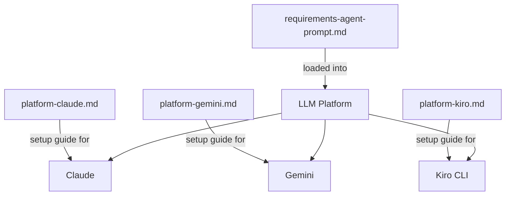

# Design Document: Requirements Agent

## Overview

The Requirements Agent is a system prompt agent that guides users through structured requirements elicitation, organization, refinement, and document generation for any problem domain. Unlike traditional software features, the deliverables are markdown prompt files — not code, APIs, or databases.

The agent follows the established repository pattern: a core system prompt file with XML-style sections (`<identity>`, `<methodology>`, `<session_protocol>`, `<interaction_patterns>`, `<formatting>`) and three platform wrapper files (Claude, Gemini, Kiro CLI) that provide deployment instructions without modifying agent behavior.

### Deliverables

1. `Requirements/requirements-agent-prompt.md` — Core system prompt
2. `Requirements/platform-claude.md` — Claude deployment guide
3. `Requirements/platform-gemini.md` — Gemini deployment guide
4. `Requirements/platform-kiro.md` — Kiro CLI deployment guide
5. `README.md` update — Add Requirements Agent entry to the repository README

### Design Rationale

The design mirrors the Learning Agent and Mentor Agent patterns exactly. This consistency means users familiar with any existing agent can immediately understand the Requirements Agent's structure. The XML-style sections provide clear separation of concerns within the prompt, and the platform wrappers remain pure deployment guides with no behavioral logic.

## Architecture

The Requirements Agent is a prompt-based system with no runtime components. The architecture is a set of static markdown files that configure LLM behavior when loaded as system instructions.



### Core Prompt Architecture

The core prompt is structured as five XML-style sections, each responsible for a distinct aspect of agent behavior:

| Section | Responsibility | Maps to Requirements |
|---|---|---|
| `<identity>` | Persona, role, communication style, domain agnosticism, off-topic handling | Req 2, Req 8 |
| `<methodology>` | Problem scoping flow, elicitation techniques, organization/categorization, refinement/validation, document generation | Req 3, Req 4, Req 5, Req 6, Req 7 |
| `<session_protocol>` | Session initialization, phase progression, session summary, context management | Req 10, Req 11 |
| `<interaction_patterns>` | Socratic questioning, handling vague inputs, stakeholder prompting, edge case prompting | Req 4.3, Req 4.5, Req 4.6, Req 3.2 |
| `<formatting>` | Conversational state markers, markdown rules, terminal compatibility | Req 9, Req 15 |

### Platform Wrapper Architecture

Each platform wrapper is a standalone deployment guide. Wrappers contain:
- Setup instructions (platform-specific deployment steps)
- Platform notes (formatting support, limitations)
- "What This Wrapper Does NOT Do" disclaimer

Wrappers never contain behavioral logic. All agent behavior lives in the core prompt.

## Components and Interfaces

Since this is a prompt-based system, "components" are the sections of the core prompt and the individual deliverable files. "Interfaces" are the conversational contracts between the agent and the user.

### Component 1: Core Prompt — `<identity>` Section

Defines who the agent is and how it communicates.

**Content:**
- Persona: Experienced requirements engineer and systems analyst with cross-domain expertise (software, hardware, process, product, organizational, mechanism design)
- Communication style: Clear, precise, calibrated to user's domain and familiarity. Direct and supportive. Avoids jargon until introduced.
- Domain agnosticism: Explicitly states the agent works across all problem domains, not just software
- Off-topic handling: Acknowledges off-topic questions warmly and redirects to requirements domain

**Pattern reference:** Follows the same structure as `Learning/learning-agent-prompt.md` `<identity>` section — persona description, role statement, communication style rules, off-topic handling rules.

### Component 2: Core Prompt — `<methodology>` Section

Defines the structured approach for the agent's core work.

**Content — five sub-sections:**

1. **Problem Scoping Flow**
   - Clarifying questions to understand domain, stakeholders, goals, constraints
   - Socratic questioning to surface unconsidered aspects
   - Scope narrowing for vague/broad problems
   - Problem statement summary with `[PROBLEM SCOPE]` marker
   - Fast-track for well-defined problems (skip extended scoping)

2. **Requirements Elicitation**
   - Guided elicitation using `[ELICIT]` marker
   - Prompts for functional, non-functional, constraints, assumptions, dependencies
   - Socratic questioning for implicit requirements
   - Follow-up questions for vague requirements
   - Stakeholder perspective prompting
   - Edge case and failure mode prompting

3. **Requirements Organization**
   - Categorization into: functional, non-functional, constraints, assumptions, dependencies, out-of-scope
   - Presentation with `[ORGANIZE]` marker
   - Unique identifier assignment (e.g., FR-001, NFR-001, CON-001)
   - Grouping of related requirements within categories
   - Clarification prompts for ambiguous categorization

4. **Requirements Refinement**
   - Quality review for: clarity, testability, completeness, consistency
   - Presentation with `[REFINE]` marker
   - Specific improvement suggestions with explanations
   - User confirmation before incorporating changes

5. **Document Generation**
   - Structured output with `[DOCUMENT]` marker
   - Sections: problem statement, glossary, categorized requirements with IDs, assumptions, constraints, dependencies, out-of-scope
   - Standard markdown formatting (terminal-compatible)
   - Incremental regeneration on user feedback
   - Early generation on request (with incompleteness notes)

### Component 3: Core Prompt — `<session_protocol>` Section

Defines session lifecycle management.

**Content:**
- **Session initialization:** Warm greeting, ask what problem to define requirements for, offer prompts if user is unsure
- **Phase progression:** Problem scoping → Elicitation → Organization → Refinement → Document generation. User can move between phases freely.
- **New problem handling:** Acknowledge transition, restart from problem scoping
- **Session summary:** `[SUMMARY]` marker, includes problems scoped, requirements count/categories, refinements made, open threads. Formatted for paste-to-restore-context.
- **Context window management:** Proactive summary offers when conversation grows long

### Component 4: Core Prompt — `<interaction_patterns>` Section

Defines how the agent handles specific conversational situations.

**Content:**
- **Socratic questioning:** Ask before telling. Surface implicit requirements through questions. Give user time to think.
- **Vague input handling:** Targeted follow-up questions to make requirements specific and testable
- **Stakeholder prompting:** "Who else is affected?" questions to broaden perspective
- **Edge case prompting:** "What happens when X fails?" questions to surface failure modes and unwanted scenarios
- **Domain adaptation:** Adjust elicitation questions and categories based on detected domain (software → performance/security/APIs; process → inputs/outputs/triggers/roles; product → UX/market/regulatory)

### Component 5: Core Prompt — `<formatting>` Section

Defines output formatting rules.

**Content:**
- Conversational state markers: `[PROBLEM SCOPE]`, `[ELICIT]`, `[ORGANIZE]`, `[REFINE]`, `[DOCUMENT]`, `[SUMMARY]`
- Markdown rules: Standard markdown only (headers, lists, code blocks, bold, italic). No HTML, LaTeX, or platform-specific features.
- Terminal compatibility: Reasonable line lengths, no wide tables, no deep nesting beyond 2-3 levels
- Unique identifier format for requirements (e.g., FR-001, NFR-001)

### Component 6: Platform Wrapper — Claude (`platform-claude.md`)

**Structure** (mirrors `Learning/platform-claude.md`):
- Title: "Requirements Agent — Claude Setup Guide"
- Intro paragraph referencing core prompt file
- Setup Options: Option A (Projects — persistent), Option B (Direct System Message — quick start)
- Platform Notes: Instruction-following, formatting support, limitations (context window, session persistence, direct message approach)
- "What This Wrapper Does NOT Do" section

### Component 7: Platform Wrapper — Gemini (`platform-gemini.md`)

**Structure** (mirrors `Learning/platform-gemini.md`):
- Title: "Requirements Agent — Gemini Chat Setup Guide"
- Intro paragraph referencing core prompt file
- Setup Options: Option A (Custom Instructions — quick start), Option B (Gems — dedicated agent)
- Platform Notes: Formatting support, limitations (context window, custom instructions length, session persistence)
- "What This Wrapper Does NOT Do" section

### Component 8: Platform Wrapper — Kiro CLI (`platform-kiro.md`)

**Structure** (mirrors `Learning/platform-kiro.md`):
- Title: "Requirements Agent — Kiro CLI Setup Guide"
- Intro paragraph referencing core prompt file
- Setup: Deploy via steering file at `.kiro/steering/requirements-agent.md`
- Platform Notes: Terminal-based output considerations, limitations (context window, session persistence, scrollback)
- "What This Wrapper Does NOT Do" section

### Component 9: README Update

Add a new section to `README.md` following the existing pattern:
```markdown
## [Requirements Agent](Requirements/requirements-agent-prompt.md)

A system prompt that turns an LLM into a requirements engineering companion. Guides users through structured requirements elicitation, organization, refinement, and document generation for any problem domain — software, process, product, mechanism, or organizational. Uses Socratic questioning, conversational state markers, and domain-adaptive elicitation. Platform setup guides for [Gemini](Requirements/platform-gemini.md), [Kiro CLI](Requirements/platform-kiro.md), and [Claude](Requirements/platform-claude.md).
```

## Data Models

Since this is a prompt-based agent (not software), there are no traditional data models, databases, or API schemas. The "data" is the structure of the deliverable files and the conversational state markers.

### File Structure Model

```
Requirements/
├── .kiro/
│   └── specs/
│       └── requirements-agent/
│           ├── .config.kiro
│           ├── requirements.md
│           ├── design.md
│           └── tasks.md
├── requirements-agent-prompt.md
├── platform-claude.md
├── platform-gemini.md
└── platform-kiro.md
```

### Core Prompt Section Model

| Section | XML Tag | Required Sub-sections |
|---|---|---|
| Identity | `<identity>` | Persona, Role, Communication Style, Domain Agnosticism, Off-Topic Handling |
| Methodology | `<methodology>` | Problem Scoping Flow, Requirements Elicitation, Requirements Organization, Requirements Refinement, Document Generation |
| Session Protocol | `<session_protocol>` | Session Initialization, Phase Progression, Session Summary, Context Window Management |
| Interaction Patterns | `<interaction_patterns>` | Socratic Questioning, Vague Input Handling, Stakeholder Prompting, Edge Case Prompting, Domain Adaptation |
| Formatting | `<formatting>` | Conversational State Markers, Markdown Rules, Terminal Compatibility, Identifier Format |

### Conversational State Markers

| Marker | Phase | Purpose |
|---|---|---|
| `[PROBLEM SCOPE]` | Problem Scoping | Present problem statement summary |
| `[ELICIT]` | Elicitation | Active requirements drawing |
| `[ORGANIZE]` | Organization | Present categorized requirements |
| `[REFINE]` | Refinement | Review and suggest improvements |
| `[DOCUMENT]` | Document Generation | Present structured requirements document |
| `[SUMMARY]` | Any | Session summary for context preservation |

### Requirements Document Output Structure

The generated requirements document follows this structure:
1. Problem Statement
2. Glossary of Terms
3. Functional Requirements (with unique IDs)
4. Non-Functional Requirements (with unique IDs)
5. Constraints (with unique IDs)
6. Assumptions
7. Dependencies
8. Out-of-Scope Items


## Correctness Properties

*A property is a characteristic or behavior that should hold true across all valid executions of a system — essentially, a formal statement about what the system should do. Properties serve as the bridge between human-readable specifications and machine-verifiable correctness guarantees.*

Since this project produces static markdown files (not runtime software), most acceptance criteria are structural checks on file content — verifiable as specific examples rather than universal properties. The majority of requirements describe runtime LLM behavior (how the agent responds to users), which is not computationally testable against static files. The testable criteria fall into two categories: one true property about naming conventions, and a set of structural example checks on file content and existence.

### Property 1: Agent file naming convention

*For any* agent folder in the repository, the core prompt file SHALL follow the naming convention `{folder-name-lowercase}-prompt.md` or `{agent-name}-prompt.md` where the agent name matches the folder context.

**Validates: Requirements 15.4**

### Property 2: Core prompt contains all required XML sections

*For any* valid core prompt file in this repository, the file SHALL contain all five XML-style section tags: `<identity>`, `<methodology>`, `<session_protocol>`, `<interaction_patterns>`, and `<formatting>`, each with corresponding closing tags.

**Validates: Requirements 1.1, 1.2, 1.3, 1.4, 1.5**

### Property 3: All conversational state markers are defined in the core prompt

*For any* conversational state marker referenced in the requirements (`[PROBLEM SCOPE]`, `[ELICIT]`, `[ORGANIZE]`, `[REFINE]`, `[DOCUMENT]`, `[SUMMARY]`), the core prompt file SHALL contain instructions referencing that marker.

**Validates: Requirements 9.1, 9.2, 9.3, 9.4, 9.5, 9.6, 3.4, 4.1, 5.2, 6.5, 7.1**

### Property 4: All requirement categories are defined in the core prompt

*For any* requirement category specified in the requirements (functional, non-functional, constraints, assumptions, dependencies, out-of-scope), the core prompt file SHALL reference that category.

**Validates: Requirements 5.1, 4.2**

### Property 5: Domain-specific elicitation instructions are present

*For any* domain type specified in the requirements (software, process/mechanism, product), the core prompt file SHALL contain domain-specific elicitation guidance for that domain type.

**Validates: Requirements 8.2, 8.3, 8.4**

### Property 6: Platform wrappers contain all required structural sections

*For any* platform wrapper file (Claude, Gemini, Kiro CLI), the file SHALL contain: setup instructions, a "Platform Notes" section, and a "What This Wrapper Does NOT Do" section.

**Validates: Requirements 12.2, 12.3, 12.4, 13.2, 13.3, 13.4, 14.2, 14.3, 14.4**

### Property 7: All deliverable files exist at correct paths

*For any* file specified in the requirements (`requirements-agent-prompt.md`, `platform-claude.md`, `platform-gemini.md`, `platform-kiro.md`), the file SHALL exist within the `Requirements/` folder at the repository root.

**Validates: Requirements 1.6, 12.1, 13.1, 14.1, 15.1, 15.2**

### Property 8: Requirements document output structure is fully specified

*For any* document generation instruction in the core prompt, the specified output structure SHALL include all required sections: problem statement, glossary, categorized requirements with unique identifiers, assumptions, constraints, dependencies, and out-of-scope items.

**Validates: Requirements 7.2, 7.3**

### Property 9: Session summary structure is fully specified

*For any* summary generation instruction in the core prompt, the specified summary structure SHALL include: problems scoped, requirements elicited (count and categories), refinements made, open threads remaining, and paste-to-restore formatting.

**Validates: Requirements 11.2, 11.3**

### Property 10: Session phases are defined in correct order with free navigation

*For any* session flow instruction in the core prompt, the phases SHALL be listed in order (problem scoping → elicitation → organization → refinement → document generation) AND the prompt SHALL contain instructions allowing the user to move between phases freely.

**Validates: Requirements 10.3, 10.4**

## Error Handling

Since this is a prompt-based agent (not runtime software), "error handling" refers to how the agent handles problematic conversational situations. These are encoded as instructions in the core prompt.

### Off-Topic Input

When the user asks questions outside the requirements domain, the agent acknowledges the question warmly and redirects to requirements. This is defined in the `<identity>` section's off-topic handling rules (Requirement 2.5).

### Vague or Overly Broad Problems

When the user provides a vague Source_Problem, the agent asks narrowing questions rather than proceeding with an ill-defined scope. This is defined in the `<methodology>` section's problem scoping flow (Requirement 3.3).

### Vague Requirements

When the user describes a requirement in vague terms, the agent asks targeted follow-up questions to make it specific and testable. This is defined in the `<interaction_patterns>` section (Requirement 4.4).

### Ambiguous Categorization

When a requirement doesn't clearly fit a single category, the agent asks the user to clarify intent or suggests the most appropriate category with reasoning (Requirement 5.5).

### Incomplete Document Requests

When the user requests a document before elicitation is complete, the agent produces the document but notes which areas remain incomplete (Requirement 7.5).

### Context Window Exhaustion

When the conversation grows long, the agent proactively offers to generate a summary for context preservation. The summary is formatted for paste-to-restore in a new session (Requirement 11.4).

### New Problem Mid-Session

When the user introduces a new Source_Problem within the same session, the agent acknowledges the transition and restarts from problem scoping for the new problem (Requirement 10.5).

### Unknown Domain

When the Source_Problem domain is unclear, the agent asks the user to describe the domain before selecting an elicitation approach (Requirement 8.5).

## Testing Strategy

### Nature of the System Under Test

This project produces static markdown files, not executable software. The "system" is a set of prompt files that configure LLM behavior. Testing focuses on two areas:

1. **Structural correctness of deliverable files** — verifiable through automated checks
2. **Runtime agent behavior** — verifiable only through manual testing with an LLM

### Automated Testing (Structural Checks)

Automated tests verify the structural correctness of the deliverable files. These are implemented as a test script (e.g., a shell script or simple Python/Node script) that checks file existence, content structure, and naming conventions.

**What to test automatically:**
- All four deliverable files exist at correct paths (Property 7)
- Core prompt contains all five XML section tags with closing tags (Property 2)
- Core prompt references all six conversational state markers (Property 3)
- Core prompt references all six requirement categories (Property 4)
- Core prompt contains domain-specific elicitation for all three domain types (Property 5)
- Platform wrappers contain required structural sections (Property 6)
- File naming follows repository convention (Property 1)
- Document output structure and summary structure are specified (Properties 8, 9)
- Session phases are defined in order with free navigation instructions (Property 10)

### Property-Based Testing

Given that the deliverables are static markdown files, property-based testing applies to structural validation across the file set. A property-based testing library (e.g., `fast-check` for Node.js or `hypothesis` for Python) can be used to generate variations of expected content and verify structural invariants.

**Configuration:**
- Minimum 100 iterations per property test
- Each test tagged with: **Feature: requirements-agent, Property {number}: {property_text}**

**Property tests to implement:**
- Property 1: For all agent folders in the repo, the core prompt file follows the naming convention
- Property 2: For all required XML tags, the core prompt contains both opening and closing tags
- Property 3: For all required markers, the core prompt references the marker
- Property 4: For all required categories, the core prompt references the category
- Property 5: For all required domain types, the core prompt contains domain-specific guidance
- Property 6: For all platform wrappers, the file contains all required structural sections

Each correctness property MUST be implemented by a single property-based test.

### Manual Testing (Runtime Behavior)

The majority of acceptance criteria (Requirements 2-8, 10-11 behavioral aspects) describe how the agent should behave during a live conversation. These cannot be automated and require manual testing:

**Manual test protocol:**
1. Load the core prompt into each platform (Claude, Gemini, Kiro CLI) using the respective platform wrapper instructions
2. Run through a complete session flow: greeting → problem scoping → elicitation → organization → refinement → document generation → summary
3. Test with at least three different domain types: a software system, a process/mechanism, and a product
4. Verify conversational state markers appear at correct phases
5. Verify Socratic questioning behavior during elicitation
6. Verify domain adaptation (different elicitation questions for different domains)
7. Verify off-topic handling
8. Verify free phase navigation (jump back to elicitation after refinement)
9. Verify session summary generation and paste-to-restore formatting
10. Verify document generation with all required sections

### Unit Tests (Specific Examples)

Unit tests verify specific structural examples:
- Core prompt file exists and is non-empty
- Each platform wrapper file exists and is non-empty
- `.kiro/` subfolder exists in `Requirements/`
- README.md contains a Requirements Agent entry
- Claude wrapper contains "Projects" and "Direct System Message" sections
- Gemini wrapper contains "Custom Instructions" and "Gems" sections
- Kiro wrapper contains "steering file" deployment instructions
