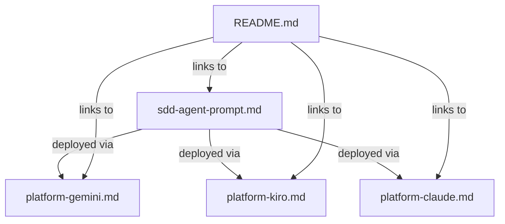

# Design Document — SDD Agent

## Overview

The SDD Agent is a system prompt that turns any LLM into a Spec Driven Development companion, guiding users through the full spec lifecycle: Requirements → Design → Tasks. It replicates Kiro's structured, iterative, phase-based methodology as a conversational experience deployable on Gemini, Kiro CLI, and Claude.

The deliverable is a set of markdown files — not code. The core prompt file (`sdd-agent-prompt.md`) contains all agent logic, methodology, templates, and interaction patterns inline. Three platform guides (`platform-gemini.md`, `platform-kiro.md`, `platform-claude.md`) provide deployment instructions without modifying agent behavior. A README entry makes the agent discoverable alongside other agents in the repository.

### Key Design Decisions

1. **Single self-contained prompt**: All SDD methodology, output templates, EARS patterns, correctness property patterns, and session management logic are defined inline in one file. No external dependencies or references to other files at runtime.
2. **Platform guides are deployment wrappers only**: Each platform guide covers setup mechanics (where to paste the prompt, how to configure the platform) and platform-specific limitations. They never duplicate or modify agent behavior.
3. **Follows existing repository conventions**: The SDD folder structure, file naming, prompt sectioning (`<identity>`, `<methodology>`, `<session_protocol>`, `<interaction_patterns>`, `<formatting>`), and README entry format match the patterns established by other agents (Learning, Design, Requirements, etc.).

## Architecture

The SDD Agent is a prompt-based system with no runtime components. The architecture is a set of authored markdown documents that configure LLM behavior on target platforms.



### Component Relationships

- The core prompt is the single source of truth for all agent behavior.
- Platform guides reference the core prompt but never redefine behavior.
- The README entry references all files for discoverability.

## Components and Interfaces

### Component 1: Core System Prompt (`SDD/sdd-agent-prompt.md`)

**Responsibility**: Define the complete SDD Agent persona, methodology, output templates, and interaction patterns.

**Internal Structure** (following repository conventions):

| Section | Responsibility |
|---|---|
| `<identity>` | Role definition, communication style, domain focus (SDD only), off-topic handling |
| `<methodology>` | Phase-based workflow (Requirements → Design → Tasks), EARS pattern rules, correctness property patterns, bugfix workflow, Socratic questioning guidelines, output templates for each phase document |
| `<session_protocol>` | Session initialization, phase progression rules, phase navigation, session summary generation, context window management, session summary restoration |
| `<interaction_patterns>` | Socratic questioning, vague input handling, iterative refinement, skip-ahead handling, direct recommendation handling |
| `<formatting>` | Conversational state markers (`[REQUIREMENTS]`, `[DESIGN]`, `[TASKS]`), markdown rules, terminal compatibility |

**Interfaces**:
- Input: User's feature/bugfix description, feedback on phase documents, session summaries from prior sessions
- Output: Requirements documents (EARS syntax, user stories, acceptance criteria, glossary), design documents (architecture, components, interfaces, data models, decisions, tradeoffs), task documents (ordered tasks, sub-tasks, acceptance criteria, traceability), session summaries

**Traces to**: Requirements 1, 2, 3, 4, 5, 6, 7, 8, 9, 12

### Component 2: Platform Guide — Gemini (`SDD/platform-gemini.md`)

**Responsibility**: Provide deployment instructions for Google Gemini (Custom Instructions and Gems setup options).

**Internal Structure**: Setup options (Custom Instructions, Gems), platform notes (formatting, context window), limitations, disclaimer.

**Traces to**: Requirement 10.1, 10.4, 10.5

### Component 3: Platform Guide — Kiro CLI (`SDD/platform-kiro.md`)

**Responsibility**: Provide deployment instructions for Kiro CLI (steering file deployment).

**Internal Structure**: Steering file setup, platform notes (terminal output), limitations, disclaimer.

**Traces to**: Requirement 10.2, 10.4, 10.5

### Component 4: Platform Guide — Claude (`SDD/platform-claude.md`)

**Responsibility**: Provide deployment instructions for Claude (Projects and Direct System Message setup options).

**Internal Structure**: Setup options (Projects, Direct System Message), platform notes (instruction-following, formatting), limitations, disclaimer.

**Traces to**: Requirement 10.3, 10.4, 10.5

### Component 5: README Entry

**Responsibility**: Make the SDD Agent discoverable in the repository root README alongside other agents.

**Internal Structure**: Single markdown section following the established format — description, link to core prompt, links to platform guides.

**Traces to**: Requirement 11

## Data Models

Since the deliverables are markdown files (not code), the "data models" are the output document templates that the SDD Agent produces during conversations. These templates are embedded in the core prompt.

### Requirements Document Template

```
# Requirements Document

## Introduction
[Problem statement and scope]

## Glossary
[Term definitions for all system names and technical terms]

## Requirements

### Requirement N: [Title]
**User Story:** As a [role], I want [feature], so that [benefit].

#### Acceptance Criteria
1. WHEN [trigger] THEN [system] SHALL [behavior]  (EARS pattern)
2. ...
```

### Design Document Template

```
# Design Document

## Overview
[High-level architecture and key decisions]

## Components
### Component N: [Name]
- Responsibility: [what it does]
- Interfaces: [inputs/outputs/contracts]
- Traces to: [requirement IDs]

## Design Decisions
### Decision N: [Title]
- Options: [A, B, C]
- Chosen: [X]
- Rationale: [why]
- Tradeoffs: [what was given up]

## Open Questions
[Unresolved items]
```

### Task Document Template

```
# Task Document

## Tasks

### Task N: [Title]
- Traces to: [design component, requirement ID]
- Acceptance Criteria: [when is this done]

#### Sub-tasks
- N.1: [Sub-task description]
- N.2: ...
```

### Session Summary Template

```
[SESSION SUMMARY]

**Feature/Bugfix:** [name]
**Current Phase:** [Requirements | Design | Tasks]
**Completed Phases:** [list with key decisions]

**Latest Documents:**
[Most recent version of each phase document]

**Open Questions:**
[Unresolved items]

**To resume:** Paste this summary into a new session.
```

### Bug Condition Document Template

```
# Bug Condition

## Observed Behavior
[What is happening]

## Expected Behavior
[What should happen]

## Reproduction Steps
1. [Step]
2. ...

## Affected Components
[List]

## Root Cause Hypothesis
[Analysis]
```


## Correctness Properties

*A property is a characteristic or behavior that should hold true across all valid executions of a system — essentially, a formal statement about what the system should do. Properties serve as the bridge between human-readable specifications and machine-verifiable correctness guarantees.*

Since the SDD Agent deliverable is a set of authored markdown files (not executable code), most acceptance criteria are testable as static content examples rather than universally quantified properties. The properties below capture the structural invariants that must hold across the deliverable files.

### Property 1: Core prompt structural conformance

*For any* required section tag in the set {`<identity>`, `<methodology>`, `<session_protocol>`, `<interaction_patterns>`, `<formatting>`}, the file `SDD/sdd-agent-prompt.md` shall contain that tag.

**Validates: Requirements 9.2**

### Property 2: Platform guide template conformance

*For any* platform guide file in the set {`SDD/platform-gemini.md`, `SDD/platform-kiro.md`, `SDD/platform-claude.md`}, the file shall contain all required template sections (setup instructions, platform notes, limitations, and a disclaimer that the guide does not modify agent behavior) AND shall contain a reference to `sdd-agent-prompt.md`.

**Validates: Requirements 10.4, 10.5**

## Error Handling

Since the deliverables are markdown files and not code, "error handling" applies to authoring correctness rather than runtime errors.

| Risk | Mitigation |
|---|---|
| Core prompt exceeds platform character limits | Platform guides document the limit and recommend the setup option with the highest character allowance (Gems for Gemini, Projects for Claude). The prompt should be as concise as possible while remaining complete. |
| Session summary is too large to paste into a new session | The session summary template is designed to be compact. The prompt instructs the agent to summarize rather than reproduce full documents when context is tight. |
| User pastes a malformed or partial session summary | The prompt instructs the agent to acknowledge what it can parse and ask clarifying questions about missing context rather than failing silently. |
| Prompt sections conflict or contradict | Each section has a single responsibility. The methodology section owns workflow logic; the session_protocol section owns session lifecycle; the formatting section owns output structure. No duplication of behavioral rules across sections. |
| Platform guide becomes stale as platform UI changes | Each platform guide includes a note that setup steps may change and directs users to the platform's official documentation for the latest UI. |

## Testing Strategy

### Dual Testing Approach

Since the deliverables are markdown files, testing is primarily structural validation and content verification rather than functional testing.

**Unit tests (example-based):**
- Verify `SDD/sdd-agent-prompt.md` exists and is non-empty
- Verify each platform guide file exists at the correct path
- Verify the README contains an SDD Agent entry with links to all deliverable files
- Verify the core prompt contains EARS pattern definitions, correctness property pattern definitions (invariant, round-trip, idempotence, metamorphic, model-based, confluence, error-condition), output templates for all three phase documents (requirements, design, tasks), bugfix workflow instructions, session summary template, and off-topic handling instructions
- Verify the bug condition template contains: observed behavior, expected behavior, reproduction steps, affected components, root cause hypothesis
- Verify the session summary template contains: current phase, completed phases, latest documents, open questions, restoration instructions

**Property tests (property-based):**
- Use a property-based testing library (e.g., fast-check for TypeScript, Hypothesis for Python, or QuickCheck for Haskell)
- Minimum 100 iterations per property test
- Each property test must reference its design document property

**Property test 1:** Feature: sdd-agent, Property 1: Core prompt structural conformance
- Generate: pick a random element from the set of required section tags
- Assert: the content of `SDD/sdd-agent-prompt.md` contains that tag

**Property test 2:** Feature: sdd-agent, Property 2: Platform guide template conformance
- Generate: pick a random platform guide file from the set of three
- Assert: the file contains all required template sections AND contains the string `sdd-agent-prompt.md`

### Manual Review Checklist

Given that the deliverables are prompts (not code), the most important validation is human review of the authored content:

- [ ] Core prompt produces well-structured requirements when given a sample feature description
- [ ] Core prompt transitions cleanly between phases
- [ ] Core prompt handles bugfix workflow correctly
- [ ] Core prompt generates session summaries that can restore context in a new session
- [ ] Each platform guide's setup instructions are accurate for the target platform
- [ ] README entry follows the same format as other agent entries
