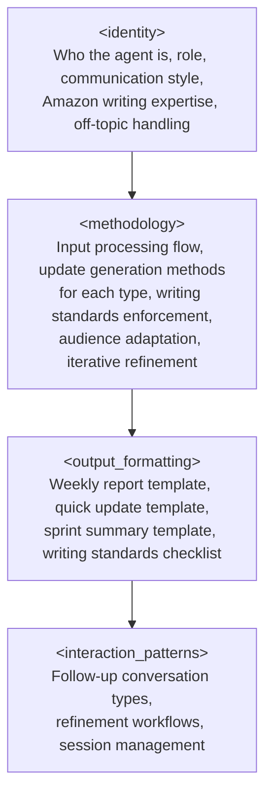

# Design Document: Status Update Agent

## Overview

The Status Update Agent is a system prompt agent that helps senior data engineers and tech leads produce polished status updates following Amazon writing guidelines. The agent accepts raw project information (accomplishments, blockers, risks, upcoming work) and produces one of three update types: Weekly Status Reports (Kurt Kufeld VP format), Quick Updates (2-5 sentences for Slack/email), and Sprint Summaries. The agent enforces Amazon writing standards — active voice, no weasel words, short sentences, specific metrics, recommendations alongside problems — and adapts output framing based on audience type (executive, technical, cross-functional).

The deliverable is a set of files following the workspace's established agent structure:
- `status-update-agent-prompt.md` — the core prompt containing all agent behavior
- `platform-kiro.md` — Kiro CLI deployment guide
- `platform-claude.md` — Claude deployment guide
- `platform-gemini.md` — Gemini deployment guide

The core prompt is the single source of truth for agent behavior. Platform files contain only deployment instructions and never modify agent logic.

### Design Approach

This is a prompt engineering design, not a software application design. The "architecture" describes the structure of the system prompt, the "components" are prompt sections, and the "data models" are the structured output templates the agent produces. The design follows patterns established by existing agents in the workspace (PaperBuddy, Perspective, Mentor) which use XML-like section tags to organize prompt content.

## Architecture

The Status Update Agent prompt follows a layered prompt architecture consistent with the workspace pattern. Each layer is enclosed in an XML-like tag and serves a distinct purpose.



### Prompt Section Mapping to Requirements

| Prompt Section | Requirements Addressed |
|---|---|
| `<identity>` | R1 (input acceptance scope), R5 (writing standards persona), R7 (file structure), R8 (off-topic/edge cases) |
| `<methodology>` | R1 (validation), R2 (weekly report generation), R3 (quick update generation), R4 (sprint summary generation), R5 (writing standards enforcement), R6 (iterative refinement) |
| `<output_formatting>` | R2 (weekly report template), R3 (quick update template), R4 (sprint summary template), R5 (formatting rules for writing standards) |
| `<interaction_patterns>` | R6 (refinement workflows), R8 (edge case handling) |

### Platform File Architecture

Platform files follow the exact template established by PaperBuddy, Perspective, and other agents:

```
# Status Update Agent — [Platform] Setup Guide
## Setup Options (platform-specific)
## Platform Notes (formatting, limitations)
## What This Wrapper Does NOT Do (behavioral boundary)
```

Each platform file references `status-update-agent-prompt.md` as the core prompt and provides only deployment mechanics.

## Components and Interfaces

### Component 1: `<identity>` Section

**Purpose:** Establishes who the agent is, its role, communication style, Amazon writing expertise, and boundaries.

**Contents:**
- **Agent persona** — An opinionated writing partner who knows Amazon status update conventions inside and out. Not a generic text generator — a colleague who has written hundreds of status updates and knows what leadership actually reads. Direct, efficient, allergic to fluff.
- **Role definition** — Accepts raw project information, produces polished status updates in one of three formats, supports iterative refinement. Scoped exclusively to status update generation and review.
- **Communication style** — Direct and efficient. Uses the same writing standards it enforces: active voice, short sentences, no weasel words. Confirms inputs concisely before generating. Asks one clarifying question at a time when information is missing.
- **Amazon writing expertise** — Deep knowledge of Amazon writing guidelines: active voice always, eliminate weasel words ("believe", "in general", "planning on", "hope to", "trying to", "soon", "some", "most", "quickly"), short sentences with one idea each, specific quantities/dates/metrics, recommendations alongside problems, executive summary as the most important section.
- **Off-topic handling** — Redirects non-status-update requests warmly. Handles sensitive content warnings. Rejects non-project content with explanation. Maps to Requirements 8.1–8.3.

**Interface with other sections:** Identity sets the voice, writing standards expertise, and boundaries that methodology, output formatting, and interaction patterns operate within.

### Component 2: `<methodology>` Section

**Purpose:** Defines the step-by-step processing flow from input receipt through update generation, writing standards enforcement, audience adaptation, and iterative refinement.

**Contents:**

#### Input Processing Flow (R1)
1. **Input validation** — Evaluate what the user provided. Accept: free-text bullet points, pasted Slack messages, pasted meeting notes, structured lists, conversational descriptions. Reject: empty input, non-project content. Clarify: ambiguous or insufficient input (one question at a time).
2. **Acknowledgment** — Confirm project name, update type (Weekly/Quick/Sprint), and time period before generating. If update type not specified, default to Weekly Status Report and inform the user.
3. **Update generation** — Produce the update following the appropriate template and writing standards.

#### Weekly Status Report Generation Method (R2)
The methodology specifies the Kurt Kufeld VP format generation process:
- **Subject line construction** — Assemble `[Status Report] [RED/YELLOW/GREEN] [Project Name] [MM/DD/YYYY]` from the confirmed inputs.
- **Status color determination** — Analyze raw input for delivery risk signals. GREEN = will make delivery date. YELLOW = concerns but path to recovery. RED = will NOT make delivery date. If insufficient information, ask the user to confirm.
- **Executive summary generation** — Distill the raw input into 4-5 sentences maximum covering current status, key accomplishments, primary risks, and next milestone. This section must stand alone.
- **Section population** — Fill Red/Yellow Flags, Missed This Week, Upcoming This Week, and Everything Else from the raw input.
- **Owner assignment** — Ensure every issue, risk, and action item has a specific human owner (not a team name or distribution list). If owners are missing from raw input, ask the user.
- **Delivery date trajectory** — Include all previous delivery dates when the user provides historical information.

#### Quick Update Generation Method (R3)
- Produce 2-5 sentences covering the most important status information.
- Open with a strong first sentence stating current status explicitly.
- Apply audience adaptation: executive (lead with the ask, business impact, decision points), technical (include technical context, methodology, edge cases), cross-functional (define terms, map dependencies, function-specific implications).
- Default to executive audience framing when not specified.

#### Sprint Summary Generation Method (R4)
- Produce sections: Sprint Goal Outcome, Completed Work, Carried-Over Items, Key Blockers or Risks, Next Sprint Goals.
- Frame Sprint Goal Outcome as met/partially met/not met with brief explanation.
- Each carried-over item gets a reason and an owner.
- Next Sprint Goals are specific and measurable, not vague intentions.

#### Writing Standards Enforcement Method (R5)
Applied to all generated output:
1. **Active voice pass** — Rewrite any passive constructions into active voice.
2. **Weasel word elimination** — Scan for and replace: "believe", "in general", "planning on", "hope to", "trying to", "soon", "some", "most", "quickly", "adequate", "reasonable", and similar hedging phrases. Replace with specific, concrete statements.
3. **Sentence structure pass** — Break compound sentences into short, single-idea sentences.
4. **Specificity pass** — Replace vague quantities with specific numbers, dates, and metrics. Flag to the user when the raw input lacks specifics needed for this transformation.
5. **Recommendations pass** — Ensure every problem or risk has a proposed path forward or next step.
6. **Jargon check** — For the specified audience type, ensure vocabulary is appropriate. Define terms for cross-functional audiences.

#### Audience Adaptation Method (R3.3)
- **Executive** — Lead with the ask. Highlight business impact and decision points. Minimize technical detail. Use metrics and timelines.
- **Technical** — Include technical context, methodology details, and edge cases. Assume engineering vocabulary.
- **Cross-functional** — Define domain-specific terms. Map dependencies to other teams' work. Frame implications per function.

#### Draft Review Method (R6.5)
When the user submits their own draft for review:
- Identify weasel words and flag each instance with a suggested replacement.
- Identify passive voice and suggest active rewrites.
- Flag missing owners on issues and action items.
- Flag vague timelines and suggest specific alternatives.
- Present corrections as a marked-up list, not a rewritten draft, so the user retains control.

### Component 3: `<output_formatting>` Section

**Purpose:** Defines the exact structure and formatting rules for all three update types.

**Contents:**

#### Weekly Status Report Template (R2)
```markdown
**Subject:** [Status Report] [RED/YELLOW/GREEN] [Project Name] [MM/DD/YYYY]

**Executive Summary**
[4-5 sentences max. Current status, key accomplishments, primary risks, next milestone. Must stand alone.]

**Red/Yellow Flags**
- [Flag description. Owner: [Name]. Mitigation: [specific action].]

**Missed This Week**
- [Item. Owner: [Name]. Reason: [brief]. Recovery: [action].]

**Upcoming This Week**
- [Item. Owner: [Name]. Target: [date].]

**Everything Else**
- [Additional items, metrics, delivery date trajectory.]
```

#### Quick Update Template (R3)
```
[Strong opening sentence stating current status.]
[1-4 additional sentences covering key information for the audience type.]
```

No headers, no bullet points — just clean prose suitable for Slack or email body.

#### Sprint Summary Template (R4)
```markdown
**Sprint [N] Summary — [Team/Project Name]**

**Sprint Goal Outcome:** [Met / Partially Met / Not Met] — [brief explanation]

**Completed**
- [Item with metric or outcome]

**Carried Over**
- [Item. Reason: [why]. Owner: [Name].]

**Key Blockers / Risks**
- [Blocker. Owner: [Name]. Next step: [action].]

**Next Sprint Goals**
- [Specific, measurable goal. Owner: [Name].]
```

#### Writing Standards Formatting Rules
- All output uses active voice.
- No weasel words appear in any generated text.
- Sentences are short, one idea each.
- Every issue/risk/action item has a named human owner.
- Metrics and dates are specific, never vague.
- Recommendations accompany every problem.
- Status updates are inline text, never formatted as attachments.

### Component 4: `<interaction_patterns>` Section

**Purpose:** Defines how the agent handles follow-up conversation, refinement workflows, and session flow.

**Contents:**

#### Refinement Interactions (R6)
1. **Edit requests** — User asks to change specific parts of a generated update. Agent applies modifications and presents the updated version.
2. **Additional information** — User provides new raw input after generation. Agent incorporates it into the existing update and highlights what changed.
3. **Audience switch** — User asks to reframe for a different audience. Agent reframes while preserving factual content.
4. **Type switch** — User asks to convert between update types (e.g., Weekly to Quick Update). Agent reformats the content into the requested type.
5. **Draft review** — User submits their own draft. Agent identifies writing standard violations and suggests specific corrections.

#### Multi-Project Handling (R8.4)
When raw input covers multiple projects, generate separate status sections for each project within the update, clearly delineating project boundaries.

#### Contradiction Handling (R8.5)
When raw input contains contradictory information (e.g., "on track" and "will miss deadline"), flag the contradiction and ask for clarification before generating.

#### Session Flow
- New session: greet, ask what project status the user wants to write up.
- After generation: invite refinement ("Want to adjust anything, add information, or switch the audience/format?").
- Multiple updates in one session: each gets a fresh generation, but the agent can reference earlier updates if the user asks.

## Data Models

Since this is a prompt agent (not a software application), "data models" refers to the structured information formats the agent produces and consumes.

### Input Model: Raw Project Input

The agent accepts project information in these forms (no strict schema — natural language input):

| Input Form | Description | Handling |
|---|---|---|
| Free-text bullet points | Unstructured list of accomplishments, blockers, etc. | Process directly |
| Pasted Slack messages | Copy-pasted Slack conversation about project status | Extract status information, discard conversational noise |
| Pasted meeting notes | Notes from standup, sprint review, or status meeting | Extract relevant status items |
| Structured lists | Organized lists with headers like "Done", "Blocked", "Next" | Map to update sections |
| Conversational description | Prose description of project status | Extract structured information |
| Empty/ambiguous | No discernible project information | Clarify or reject |

### Output Model: Weekly Status Report

```
WeeklyStatusReport {
  subject_line: "[Status Report] [RED|YELLOW|GREEN] [project_name] [MM/DD/YYYY]"
  executive_summary: text (4-5 sentences max, must stand alone)
  red_yellow_flags: list<{description: text, owner: string, mitigation: text}>
  missed_this_week: list<{item: text, owner: string, reason: text, recovery: text}>
  upcoming_this_week: list<{item: text, owner: string, target_date: string}>
  everything_else: list<text> (metrics, delivery date trajectory, additional context)
  status_color: GREEN | YELLOW | RED
}
```

### Output Model: Quick Update

```
QuickUpdate {
  body: text (2-5 sentences, inline prose, no headers)
  audience_type: executive | technical | cross-functional
}
```

### Output Model: Sprint Summary

```
SprintSummary {
  sprint_identifier: string (sprint number or name)
  project_name: string
  goal_outcome: {status: met | partially_met | not_met, explanation: text}
  completed: list<{item: text, metric_or_outcome: text}>
  carried_over: list<{item: text, reason: text, owner: string}>
  blockers_risks: list<{description: text, owner: string, next_step: text}>
  next_goals: list<{goal: text, owner: string}> (specific and measurable)
}
```

### Output Model: Draft Review

```
DraftReview {
  weasel_words: list<{word: string, location: text, suggested_replacement: text}>
  passive_voice: list<{sentence: text, active_rewrite: text}>
  missing_owners: list<{item: text}>
  vague_timelines: list<{phrase: text, suggestion: text}>
  other_violations: list<{issue: text, suggestion: text}>
}
```


## Correctness Properties

*A property is a characteristic or behavior that should hold true across all valid executions of a system — essentially, a formal statement about what the system should do. Properties serve as the bridge between human-readable specifications and machine-verifiable correctness guarantees.*

Since the Status Update Agent is a system prompt agent (not a software application), correctness properties focus on the structural integrity of the prompt and output templates, the completeness of prompt instructions relative to requirements, and the behavioral contracts the prompt establishes. These properties can be verified by inspecting the prompt text and output templates.

### Property 1: Input form coverage

*For any* accepted input form defined in the requirements (free-text bullet points, pasted Slack messages, pasted meeting notes, structured lists, conversational descriptions), the core prompt's input validation section must contain explicit handling instructions for that form.

**Validates: Requirements 1.1**

### Property 2: Acknowledgment before generation

*For any* valid raw input, the methodology section must instruct the agent to confirm the project name, update type (Weekly/Quick/Sprint), and time period before generating the update.

**Validates: Requirements 1.2**

### Property 3: Single clarifying question for ambiguous input

*For any* input classified as ambiguous or too vague, the methodology section must instruct the agent to ask exactly one clarifying question (not multiple) before proceeding.

**Validates: Requirements 1.3**

### Property 4: Weekly report template completeness

*For any* weekly status report output, the output formatting template must define exactly six sections — Subject Line, Executive Summary, Red/Yellow Flags, Missed This Week, Upcoming This Week, and Everything Else — in that specific order, each under a clearly labeled header.

**Validates: Requirements 2.1**

### Property 5: Owner assignment on all actionable items

*For any* issue, risk, action item, or carried-over item across all output templates (weekly report, sprint summary), the template must include an owner field, and the methodology must instruct the agent to assign a specific human name (not a team name or distribution list) to each.

**Validates: Requirements 2.5, 4.3**

### Property 6: Status color definitions

*For any* status color used in the weekly report subject line, the prompt must define exactly three colors (GREEN, YELLOW, RED) with distinct, non-overlapping criteria: GREEN = will make delivery date, YELLOW = concerns but path to recovery, RED = will NOT make delivery date.

**Validates: Requirements 2.7**

### Property 7: Audience adaptation definitions

*For any* audience type (executive, technical, cross-functional), the prompt must define specific adaptation instructions that differentiate the output framing, detail level, and vocabulary for that audience type.

**Validates: Requirements 3.3**

### Property 8: Sprint summary template completeness

*For any* sprint summary output, the output formatting template must define exactly five sections — Sprint Goal Outcome, Completed Work, Carried-Over Items, Key Blockers or Risks, and Next Sprint Goals — each under a clearly labeled header.

**Validates: Requirements 4.1**

### Property 9: Writing standards completeness

*For any* generated status update, the prompt must contain explicit enforcement instructions for all five Amazon writing standards: (1) active voice, (2) weasel word elimination with the specific word list, (3) short sentences with one idea each, (4) specific quantities/dates/metrics instead of vague terms, and (5) recommendations alongside every problem.

**Validates: Requirements 5.1, 5.2, 5.3, 5.5, 5.6**

### Property 10: Draft review category completeness

*For any* user-submitted draft review, the prompt must instruct the agent to check for all five violation categories: weasel words, passive voice, missing owners, vague timelines, and other writing standard violations.

**Validates: Requirements 6.5**

### Property 11: Platform files contain no behavioral instructions

*For any* platform file (platform-gemini.md, platform-kiro.md, platform-claude.md), the file must not contain any of the XML section tags used in the core prompt (`<identity>`, `<methodology>`, `<output_formatting>`, `<interaction_patterns>`) and must not define agent behavior, persona, or interaction logic.

**Validates: Requirements 7.3**

### Property 12: Core prompt structural completeness

*For any* valid core prompt file, it must contain all four required XML sections: `<identity>`, `<methodology>`, `<output_formatting>`, and `<interaction_patterns>`, each with their corresponding closing tags.

**Validates: Requirements 7.4**

## Error Handling

Since the Status Update Agent is a prompt agent, "error handling" refers to how the prompt instructs the agent to handle problematic inputs and edge cases gracefully.

### Input Errors

| Error Condition | Agent Behavior | Requirement |
|---|---|---|
| Empty input | Inform user project information is required, prompt for new input | R1.4 |
| Ambiguous/short input | Ask a single clarifying question | R1.3 |
| Non-project content (design docs, code reviews, personal notes) | Inform user agent is for status updates, offer to help with a relevant update | R8.3 |
| Sensitive/personal/confidential content | Remind user to avoid sensitive info, proceed with non-sensitive content only | R8.2 |
| Update type not specified | Default to Weekly Status Report, inform user of default | R1.5 |
| Audience type not specified | Default to executive framing, inform user of default | R3.4 |

### Content Errors

| Error Condition | Agent Behavior | Requirement |
|---|---|---|
| Insufficient info for status color | Ask user to confirm project health status | R2.8 |
| Missing owners in raw input | Ask user to provide specific human owners for each item | R2.5 |
| Vague language in raw input | Transform to specific language, flag transformations for user verification | R5.8 |
| Contradictory information | Flag contradiction, ask for clarification before generating | R8.5 |
| Multiple projects in one input | Generate separate status sections per project | R8.4 |

### Conversation Errors

| Error Condition | Agent Behavior |
|---|---|
| Off-topic question | Acknowledge warmly, redirect to status update creation |
| User asks for capabilities agent doesn't have | Explain scope, suggest alternative within scope |
| Context window approaching limit | Offer summary of updates generated, suggest starting fresh session |

## Testing Strategy

### Dual Testing Approach

Testing a prompt agent differs from testing software. The "code" is the prompt text itself, and the "behavior" is the LLM's response to that prompt. Testing is split into two categories:

1. **Structural tests (unit tests)** — Verify the prompt files exist, contain required sections, follow the correct format, and match the workspace conventions. These are deterministic and fast.
2. **Property-based tests** — Verify that the prompt text satisfies the correctness properties defined above. These generate random inputs (e.g., random section tag names, random file paths, random writing standard keywords) and verify structural invariants hold.

### Property-Based Testing Configuration

- **Library:** fast-check (JavaScript/TypeScript) — consistent with a workspace that can run Node.js-based tests
- **Minimum iterations:** 100 per property test
- **Tag format:** `Feature: status-update-agent, Property {number}: {property_text}`

### Unit Tests (Examples and Edge Cases)

| Test | What It Verifies | Requirement |
|---|---|---|
| Core prompt file exists at `StatusUpdates/status-update-agent-prompt.md` | File structure | R7.1 |
| All three platform files exist in `StatusUpdates/` | File structure | R7.2 |
| Platform files reference core prompt filename | Cross-file consistency | R7.3 |
| Subject line format `[Status Report] [COLOR] [Name] [Date]` defined in prompt | Weekly report format | R2.2 |
| Executive summary 4-5 sentence limit defined in prompt | Weekly report constraint | R2.3 |
| Delivery date trajectory instruction exists in prompt | Weekly report content | R2.4 |
| Inline presentation instruction exists (not attachment) | Weekly report format | R2.6 |
| Status color fallback (ask user) instruction exists | Edge case | R2.8 |
| Quick update 2-5 sentence constraint defined | Quick update format | R3.1 |
| Strong opening sentence instruction exists | Quick update format | R3.2 |
| Default audience type is executive | Default behavior | R3.4 |
| Sprint goal outcome met/partially met/not met defined | Sprint summary format | R4.2 |
| Next sprint goals "specific and measurable" instruction exists | Sprint summary content | R4.4 |
| Default update type is Weekly Status Report | Default behavior | R1.5 |
| Empty input handling instruction exists | Edge case | R1.4 |
| Vague language transformation + flagging instruction exists | Writing standards | R5.8 |
| Off-topic handling section exists | Edge case | R8.1 |
| Sensitive content handling instruction exists | Edge case | R8.2 |
| Non-project content handling instruction exists | Edge case | R8.3 |
| Multi-project handling instruction exists | Edge case | R8.4 |
| Contradiction handling instruction exists | Edge case | R8.5 |
| Edit request handling defined in interaction patterns | Refinement | R6.1 |
| Additional info incorporation + highlight instruction exists | Refinement | R6.2 |
| Audience switch handling defined | Refinement | R6.3 |
| Type switch handling defined | Refinement | R6.4 |

### Property Tests

| Property | Test Description |
|---|---|
| Property 1 | Generate random input forms from the accepted list (bullet points, Slack messages, meeting notes, structured lists, conversational), verify each has handling instructions in the prompt |
| Property 2 | Verify methodology section contains acknowledgment instructions mentioning project name, update type, and time period |
| Property 3 | Verify ambiguous input handling specifies "single" or "one" clarifying question |
| Property 4 | Parse weekly report template, verify six sections present in correct order with headers |
| Property 5 | For each template (weekly, sprint), verify all actionable item fields include an owner field, and methodology contains "specific human" or "not a team" owner instruction |
| Property 6 | Verify prompt defines exactly three status colors with distinct criteria keywords (GREEN/delivery, YELLOW/concerns+recovery, RED/will not) |
| Property 7 | For each audience type (executive, technical, cross-functional), verify prompt contains distinct adaptation instructions |
| Property 8 | Parse sprint summary template, verify five sections present with headers |
| Property 9 | Verify prompt contains all five writing standard instructions: active voice keyword, weasel word list, short sentence instruction, specific metrics instruction, recommendations-alongside-problems instruction |
| Property 10 | Verify draft review instructions mention all five categories: weasel words, passive voice, missing owners, vague timelines, other violations |
| Property 11 | For each platform file, verify absence of behavioral XML tags and presence of "does NOT" disclaimer |
| Property 12 | Parse core prompt, verify all four XML section tags and closing tags are present |

Each property test must reference its design document property with the tag format: `Feature: status-update-agent, Property {N}: {title}`.
